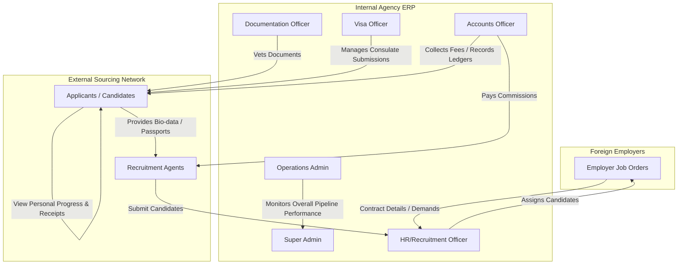

# Product Overview - Overseas Manpower ERP

This document outlines the core vision, objectives, scope boundaries, and primary lifecycle pipelines of the Overseas Manpower ERP. It establishes the architectural foundations to prevent feature drift and guides subsequent implementation.

## 1. Executive Summary & Core Identity

The **Overseas Manpower ERP** is a proprietary, company-internal Enterprise Resource Planning (ERP) platform designed specifically for an overseas manpower supply and recruitment agency. Its purpose is to manage, monitor, and automate the highly regulated process of sourcing, vetting, training, securing visas for, and deploying candidate laborers to foreign employers.

### ⚠️ Critical Scope Distinctions
This is **NOT a public job board** (like LinkedIn or Indeed). It is a highly controlled B2B2C ERP. 

| Feature | Public Job Board | Overseas Manpower ERP |
| :--- | :--- | :--- |
| **User Sign-up** | Open public registration for anyone. | Created by Agency Staff/Agents first. Applicant claims portal access later via OTP/Invite. |
| **Job Discovery** | Public, searchable list of active jobs. | Hidden internal Job Orders mapped to candidates by internal staff. |
| **Job Application** | Direct self-apply by candidate. | Candidates are assigned/linked to pre-vetted Job Orders by HR Officers. |
| **Workflow Controls**| Candidate-driven updates (e.g. withdraw).| Staff-driven official compliance steps (Medical, Visa, Tickets). |
| **Focus** | Job matching & advertising. | Logistics, regulatory compliance, finance, agent commission, and audit logs. |

---

## 2. Business Goals & Objectives

1. **Compliance Rigor**: Ensure zero-fault compliance with government emigration departments and foreign consulates.
2. **Operational Transparency**: Maintain absolute auditability on where an applicant is stuck (e.g., Medical center, Embassy, or Ticketing office).
3. **Double-Entry Financial Integrity**: Every candidate has a personalized transaction ledger showing exact receivables, payments made, invoices raised, and agent commissions computed.
4. **Agent Loyalty Management**: Establish clear, error-free commission tracking for recruitment agents who source labor from remote or rural regions.
5. **Efficiency**: Reduce placement pipeline latency (the time from initial sourcing to deployment flight) by at least 30% through automated notifications and digital document verification.

---

## 3. High-Level System Context Diagram

The ERP interacts with several external entities and actors, coordinated through strict role parameters:

---

## 4. End-to-End Operational Lifecycle Pipeline

The operational lifecycle of a candidate is linear, strict, and stateful. Every candidate must pass through these distinct phases, with specific staff roles executing the validations:

### Phase 1: Demand Sourcing & Job Orders
* Foreign employers issue a **Job Order** (or Demand Letter) specifying roles needed (e.g., "50 Scaffolders for Saudi Arabia", salary, perks, age limits).
* Operations Admin enters the Job Order into the system, detailing the visa quotas and financial parameters.

### Phase 2: Candidate Intake & Sourcing
* **Agent Sourcing**: Authorized Agents log in, view the active Job Orders open to their quota, and upload applicant bio-data (including passport, full name, phone, email, and DOB).
* **Direct Sourcing**: HR Officers register walk-in applicants and log them in under the "Direct" agent profile.
* **Portal Invitation & Claim**: The candidate file is created *without* an active `User` login account. Later, an invite or OTP is triggered by the agency. The applicant clicks the link or receives the OTP, verifies their passport/phone, and claims/creates their active `User` credential to access the portal.

### Phase 3: Selection & Vetting
* HR Officers schedule interviews (physical or virtual).
* Candidate status changes from `APPLIED` to `INTERVIEWED` and then `SELECTED` (or `REJECTED`).
* Selected candidates are officially matched to a Job Order, locking in their financial package and commission profiles.

### Phase 4: Compliance & Logistics Vetting (The Agency Pipeline)
Once selected, candidate processing is split between specialized officers:
* **Medical**: The Documentation Officer inputs medical center routing and updates status to `MEDICAL_PASSED` or `MEDICAL_FAILED`.
* **Training & Attestation**: Documentation Officer verifies government clearance cards, occupational training certificates, and police clearances.
* **Visa Submission**: The Visa Officer processes documents for consulate submission. Status transitions to `VISA_SUBMITTED`, then to `VISA_STAMPED` or `VISA_REJECTED`.
* **Flight & Ticketing**: Operations Admin/Visa Officer enters flight details, airline PNR, and tickets. Status transitions to `TICKETED`.

### Phase 5: Financial Operations
* Accounts Officer registers the candidate's custom financial profile based on their Job Order package.
* **Invoicing**: Invoices are automatically generated for fees (medical fee, visa fee, agency service charge).
* **Receipts**: Candidate pays at the agency counter or bank transfer. The Accounts Officer logs the payment, generating an immutable Receipt. The ledger updates instantly.
* **Commission Computation**: Once the candidate status hits `VISA_STAMPED` or `DEPLOYED`, the agent's commission is automatically calculated and unlocked for payout.

### Phase 6: Emigration & Deployment
* Emigration clearances are verified.
* The flight takes off, and the status changes to `DEPLOYED`.
* Archive processes trigger, leaving candidate files readable but immutable for subsequent years for audit purposes.

---

## 5. What this ERP is NOT (Strict Boundaries)

1. **No Anonymous Job Board**: A guest user visiting the ERP landing page will only see a premium secure login portal. There is no public "Careers" or "Job List" page.
2. **No Applicant Self-Matching**: Applicants cannot browse other Job Orders to swap positions. They are matched by HR staff and can only see the specific job they have been selected for.
3. **No Direct Messaging Between Applicant and Employer**: All communications flow strictly through the Agency's coordination staff to preserve regulatory compliance and agency service fees.
4. **No Financial Deletions**: Under no circumstances can invoices or receipts be deleted. They must be formally reversed using Credit Notes or Cancellation transactions to ensure a perfect forensic audit trail.
