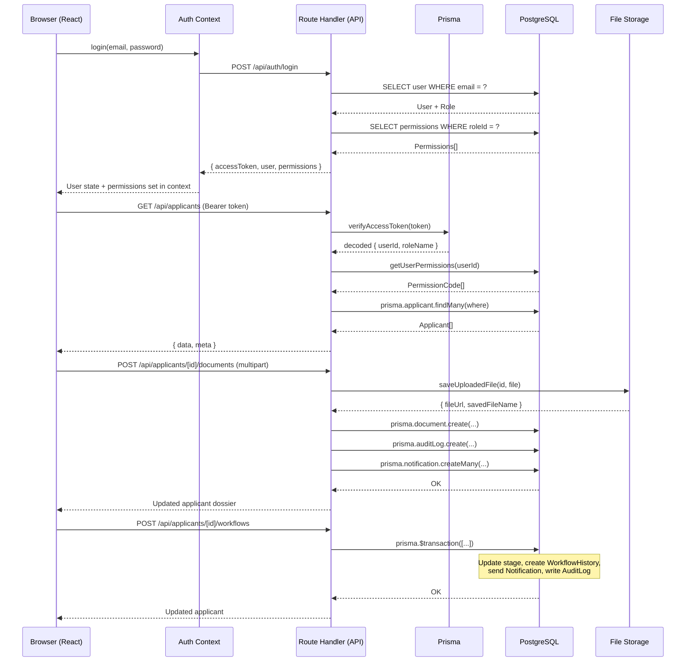

# 02 — System Architecture

## Overview

OverseasERP uses a **monorepo architecture** where the frontend and backend live in the same Next.js project. The App Router handles both page rendering and API logic.

---

## Frontend Architecture

**Framework:** Next.js 16 (App Router)  
**Language:** TypeScript  
**Styling:** Tailwind CSS v4 with CSS variables  
**UI Components:** Custom components built with Tailwind utilities  
**Icons:** Lucide React  

### Key Frontend Concepts

**Client Components (`"use client"`):** All interactive pages and components that use state, effects, or context. Most page files are client components because they fetch data from the API on mount.

**Server Components:** Layout files (`layout.tsx`) and the root page (`page.tsx`) are server components that handle routing and shell rendering.

**Context Providers:** Three React contexts wrap the application:
- `MockAuthProvider` — manages JWT session, user state, and RBAC permission gates
- `ThemeProvider` — manages light/dark theme, persists to `localStorage`
- `DialogContext` — manages modal/confirm dialog state (custom replacement for browser `alert()`/`confirm()`)
- `ToastContext` — manages toast notification state

### Frontend Folder Structure

```
src/
  app/                         # Next.js App Router pages and layouts
    layout.tsx                 # Root layout: wraps all contexts
    page.tsx                   # Root redirect (/ → /login or /dashboard)
    globals.css                # CSS variables, design tokens, utility classes
    login/                     # Login page (public)
    dashboard/                 # Role-specific dashboard page
    applicants/                # Applicant list + detail pages
      [id]/                    # Applicant dossier page
    applicant/portal/          # Self-service applicant portal
    agents/                    # Agent management page
    job-orders/                # Job order management page
    documents/                 # Global document queue page
    accounts/                  # General ledger page
    commissions/               # Commission management page
    receipts-invoices/         # Receipts and invoices browser page
    reports/                   # Reports and exports page
    notifications/             # Notifications page
    audit-logs/                # Audit log viewer page
    rbac/                      # RBAC settings page
    workflow/                  # (route stub)
    denied/                    # Access denied page
    api/                       # Backend API route handlers
  components/
    layout/
      AppShell.tsx             # Main app shell wrapper
      Sidebar.tsx              # Permission-gated sidebar navigation
      Topbar.tsx               # Top bar with theme toggle, notifications, logout
    shared/                    # Shared UI components
    theme/                     # Theme toggle button component
    ui/                        # Reusable UI primitives
  context/
    MockAuthContext.tsx        # Auth context (JWT login, refresh, logout, RBAC)
    ThemeContext.tsx            # Theme context (light/dark)
    DialogContext.tsx          # Modal/confirm dialog context
    ToastContext.tsx           # Toast notification context
  lib/
    auth.ts                    # JWT signing/verification with jose
    rbac.ts                    # Database-backed permission loading
    permissions.ts             # Static RBAC role/permission definitions
    workflow-rules.ts          # Stage transition rules and document prerequisites
    storage.ts                 # Local file storage helpers
    csv.ts                     # CSV building and response helpers
    db.ts                      # Prisma client singleton
    mockData.ts                # Seed-compatible demo user definitions
    sequence.ts                # Auto-increment sequence generators (invoice/receipt numbers)
```

---

## Backend Architecture

The backend uses **Next.js App Router Route Handlers** (`route.ts` files inside `src/app/api/`). These are server-side functions that run in the Node.js environment and handle HTTP requests directly.

### Why Route Handlers Instead of a Separate API Server?

- **Zero additional infrastructure** — no Express, Fastify, or separate Node server needed
- **Colocation** — backend API code lives alongside the frontend pages in the same repo
- **Edge and Node compatible** — route handlers support standard `Request`/`Response` Web APIs
- **Prisma runs server-side only** — Prisma Client never touches the browser
- **Simpler deployment** — one Next.js process serves both the UI and the API

### API Folder Structure

```
src/app/api/
  auth/
    login/route.ts             # POST /api/auth/login
    logout/route.ts            # POST /api/auth/logout
    refresh/route.ts           # POST /api/auth/refresh
    me/route.ts                # GET /api/auth/me

  applicants/
    route.ts                   # GET/POST /api/applicants
    [id]/
      route.ts                 # GET/PATCH /api/applicants/[id]
      workflows/route.ts       # POST /api/applicants/[id]/workflows
      documents/
        route.ts               # POST /api/applicants/[id]/documents
        [docId]/
          route.ts             # GET/PATCH /api/applicants/[id]/documents/[docId]
          download/route.ts    # GET /api/applicants/[id]/documents/[docId]/download
      invoices/route.ts        # POST /api/applicants/[id]/invoices
      receipts/route.ts        # POST /api/applicants/[id]/receipts (via invoice)
      archive/route.ts         # PATCH /api/applicants/[id]/archive

  applicant/
    portal/route.ts            # GET /api/applicant/portal (self-service)

  finance/
    invoices/route.ts          # GET /api/finance/invoices
    receipts/route.ts          # GET /api/finance/receipts
    commissions/
      route.ts                 # GET /api/finance/commissions
      accrue/route.ts          # POST /api/finance/commissions/accrue
      [id]/payout/route.ts     # PATCH /api/finance/commissions/[id]/payout

  accounts/
    ledger/route.ts            # GET /api/accounts/ledger

  reports/
    dashboard/route.ts         # GET /api/reports/dashboard

  notifications/
    route.ts                   # GET /api/notifications
    [id]/route.ts              # PATCH /api/notifications/[id]
    mark-all-read/route.ts     # POST /api/notifications/mark-all-read

  audit-logs/
    route.ts                   # GET /api/audit-logs

  exports/
    applicants/route.ts        # GET /api/exports/applicants (CSV)
    invoices/route.ts          # GET /api/exports/invoices (CSV)
    receipts/route.ts          # GET /api/exports/receipts (CSV)
    ledger/route.ts            # GET /api/exports/ledger (CSV)
    commissions/route.ts       # GET /api/exports/commissions (CSV)
    audit-logs/route.ts        # GET /api/exports/audit-logs (CSV)
```

---

## Prisma / PostgreSQL Database Layer

**ORM:** Prisma 7  
**Database:** PostgreSQL 16  
**Connection config:** `prisma.config.ts` (Prisma 7 moved connection URL out of `schema.prisma`)  
**Generated client:** `generated/prisma/` (output of `prisma generate`)  
**Migrations:** `prisma/migrations/`  
**Seed script:** `prisma/seed.ts`  

The Prisma singleton is in `src/lib/db.ts` and reuses one connection pool instance across hot reloads in development.

---

## Auth / RBAC Layer

**Library:** `jose` (edge-compatible JWT, no native Node crypto dependency)  
**Password hashing:** `argon2`  

### Token Architecture
- **Access Token** — short-lived JWT (15 minutes by default), stored in React state (`MockAuthContext`) and sent as `Authorization: Bearer <token>` on every API call
- **Refresh Token** — long-lived JWT (7 days by default), stored in an **HttpOnly, Secure, SameSite=Strict cookie** — never accessible to JavaScript

### RBAC Architecture
- Roles and permissions are stored in the `Role`, `Permission`, and `RolePermission` tables in the database
- At login, the backend fetches all permissions for the user's role from `RolePermission` and returns them in the login response
- The frontend stores permissions in `MockAuthContext` and uses `hasAccess(permission)` to gate UI elements
- The backend validates permissions again on every API call — the frontend RBAC is for UX only; the backend is the true enforcer

---

## File Upload / Private Storage Layer

**Storage location:** `storage/applicants/{applicantId}/documents/` (relative to project root)  
**Access:** Files are NOT served as static assets. They are served only through the authenticated download API endpoint: `GET /api/applicants/[id]/documents/[docId]/download`  

**Upload validation (in `src/lib/storage.ts`):**
- Maximum file size: 5 MB
- Allowed MIME types: `application/pdf`, `image/jpeg`, `image/png`
- Allowed extensions: `.pdf`, `.jpeg`, `.jpg`, `.png`
- File names are sanitized to remove path traversal characters
- A UUID-based unique filename is generated server-side (original name preserved in `fileName` column)

---

## Theme / UI Layer

**Approach:** Light-mode-first, manual dark mode toggle  
**Mechanism:** CSS custom properties (variables) defined in `globals.css` — one set for `:root` (light), one set for `[data-theme="dark"]`  
**Tailwind:** Variables are mapped into Tailwind's `@theme` configuration block so they can be used as utilities (e.g. `bg-surface`, `text-text-muted`, `border-border-theme`)  
**Toggle:** The `ThemeProvider` in `ThemeContext.tsx` sets `data-theme` on the `<html>` element and persists the choice in `localStorage`  
**Dark variant:** Tailwind's `dark:` prefix is bound to `[data-theme="dark"]` via `@custom-variant dark`

---

## Data Flow Diagram



---

## Technology Stack Summary

| Layer | Technology | Version |
|-------|-----------|---------|
| Framework | Next.js | 16.2.6 |
| Language | TypeScript | 5.x |
| React | React | 19.x |
| Database | PostgreSQL | 16 (Docker) |
| ORM | Prisma | 7.8.0 |
| JWT | jose | 6.x |
| Password Hash | argon2 | 0.44.0 |
| Styling | Tailwind CSS | 4.x |
| Icons | Lucide React | 1.x |
| HTTP Adapter | @prisma/adapter-pg + pg | 7.x / 8.x |
