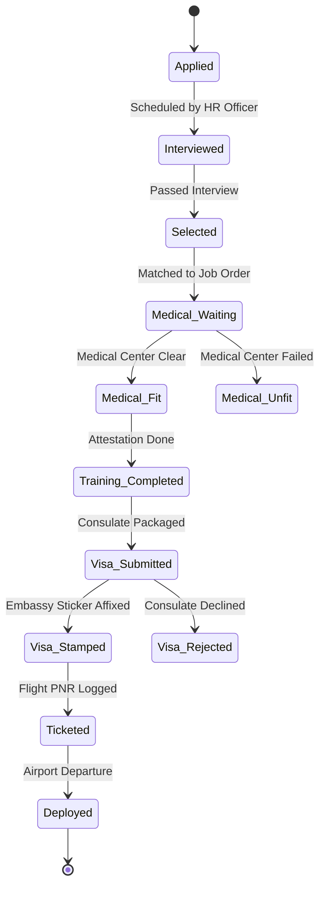

# UI/UX Flow & Layout Specifications

This document defines the interface architecture, navigation layouts, and portal screens for the Overseas Manpower ERP. Use these specifications to build modern, responsive, and role-tailored Next.js frontend pages.

---

## 1. Master Shell & Navigation Structures

The application splits into three distinct portal layouts based on the active role context, ensuring strict data boundaries.

### Layout A: Agency Staff Portal (Super Admin, Ops, Officers)
A dual-tier navigation system built for high-density data management:
* **Primary Left Sidebar**: Icon-only quick-jump (Dashboard, Applicants, Job Orders, Agents, Accounts, Reports, System Logs).
* **Secondary Contextual Sidebar**: Collapsible text list depending on the selected module (e.g. under "Applicants" -> "All Active", "Interviews scheduled", "Medical pending", "Emigration cleared").
* **Top Header Bar**: Search bar (global search by passport/candidate name), quick notification count indicator, user profile menu with active role indicator.

```
+--------------------------------------------------------------------------------+
| [LOGO] | Search passport/name...                        (Notifications) (Profile)|
+--------+-----------------------------------------------------------------------+
| (DASH) | Applicants List      |  [ + Register New Applicant ]                   |
| (APPL) | > Active Pipeline    |                                                |
| (JOBS) | > Pre-Selected       |  Show [10] entries                             |
| (AGEN) | > Medical Queue      |  +----+------------------+---------------+     |
| (ACCT) | > Visa Stamping      |  | ID | Candidate Name   | Passport No.  |     |
| (REPT) | > Emigration Flight  |  +----+------------------+---------------+     |
| (AUDT) |                      |  | 01 | John Doe         | EH1234567     |     |
| (RBAC) |                      |  +----+------------------+---------------+     |
+--------+----------------------+------------------------------------------------+
```

### Layout B: Agent Portal
A simplified dashboard focusing strictly on candidate onboarding and commissions:
* **Top Horizontal Navbar**: Logo, Dashboard link, Sourced Applicants Directory, New Candidate Registration Form, Commission Statement, Notifications.
* **Main Area**: Centered, card-based statistics and responsive table containing *only* this agent's submitted cohort.

### Layout C: Applicant Portal (Self-Service View)
An ultra-premium, modern, mobile-friendly card dashboard:
* **Layout**: Centered container with a sleek glassmorphic card profile header, followed by a bold pipeline progress card, document upload zone, and invoice list. No left sidebars. Minimalist top bar with a Logout button.

---

## 2. Dynamic Workflow Progress Stepper (Applicant Detail Page)

On the Applicant Detail screen, the system renders a prominent, interactive horizontal progress stepper indicating the exact workflow state.



### Interactive UI Stepper Component Behavior:
* **UI Label Resolution**: The frontend dynamically reads the database enum string (e.g. `TRAINING_COMPLETED`) and translates it into a polished, localized title (e.g. "Pre-Departure Training Completed") before rendering.
* **Visual States**:
  - **Completed Stages**: Rich forest-green circles with a checkmark.
  - **Current Active Stage**: Vibrant pulsing blue circle.
  - **Pending Stages**: Subtle, slate-gray circles with muted numbers.
  - **Blocked/Failed States** (e.g. `MEDICAL_UNFIT`, `VISA_REJECTED`): Highlighted in dark red, halting the stepper rendering and showing a detailed issue card.
* **Role Actions Sidebar**: If the logged-in user is an officer assigned to the current active stage, a sidebar card displays context-specific action forms (e.g., if stage is `VISA_SUBMITTED`, the Visa Officer sees a form requesting: *Embassy Sticker Number*, *Stamping Date*, and *Upload Scan of Visa Page*).

---

## 3. Wireframe Blueprint: Applicant Detail Screen (Staff View)

This high-density view consolidates all candidate metadata, logistical stages, documents, and finances into structured tabs:

```
+--------------------------------------------------------------------------------+
| Applicant Detail: MOHAMMAD AL-AMIN (ID: APP-2026-897)  [Edit Bio] [Print Folder]|
+--------------------------------------------------------------------------------+
| STEPPER: [Applied] -> [Selected] -> [Medical Fit] -> (Visa Submitted) -> Stamped |
+--------------------------------------------------------------------------------+
| TABS: [1. Bio-Data]   [2. Compliance Checklist]   [3. Financial Ledger]   [4. Logs]
+--------------------------------------------------------------------------------+
| ACTIVE TAB: 3. Financial Ledger                                                |
|                                                                                |
| Outstanding Balance: $1,200.00                                                 |
| +----------------------------------------------------------------------------+ |
| | Date       | Transaction Type | Ref No.      | Debit ($) | Credit ($) | Bal | |
| +------------+------------------+--------------+-----------+------------+-----+ |
| | 2026-05-10 | Job Order Fee    | INV-2026-042 | 2,500.00  | 0.00       |2,500| |
| | 2026-05-12 | First Installment| REC-2026-015 | 0.00      | 1,300.00   |1,200| |
| +------------+------------------+--------------+-----------+------------+-----+ |
|                                                                                |
| [ + Record Payment Receipt ]              [ Print Consolidated Statement ]      |
+--------------------------------------------------------------------------------+
```

---

## 4. UI/UX Core Interactions & Motion Design Guidelines

To match premium enterprise design systems, developers must implement the following behaviors:
1. **Empty States**: If a table is empty, do not show a blank white block. Display a custom vector illustration with a clear action button (e.g., "No Applicants Found - Click here to submit your first applicant").
2. **Glassmorphism**: Dashboards should leverage dark-mode compatibility with smooth blurred backdrops (`backdrop-filter: blur(8px)`) for card container modules.
3. **Form Micro-interactions**:
   * All form fields must feature floating labels that scale down when focused.
   * Save operations must disable submission buttons immediately, rendering a subtle loading spinner inside the button to prevent duplicate submissions.
   * State transitions must trigger a system-wide confettis animation *only* when the stage hits `VISA_STAMPED` or `DEPLOYED` to celebrate successful completions.
4. **Modals**: All modal popups must animate smoothly from the bottom on mobile view and fade-in/scale-up on desktop view. They must close on pressing the `Escape` key or clicking outside.
5. **Keyboard Shortcuts**:
   * `Ctrl + K`: Open Global Applicant Search.
   * `Esc`: Close any active modal.
   * `Ctrl + P`: Print the currently active ledger statement or applicant folder view.
