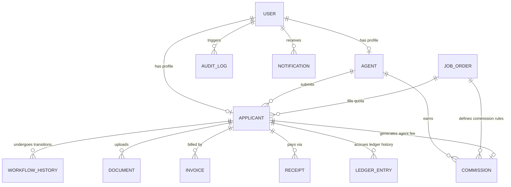

# Database Plan & Prisma Schema

This document defines the relational database architecture for the Overseas Manpower ERP using Prisma ORM notation for PostgreSQL. It includes models, enums, relationship rules, and performance indexing strategies.

---

## 1. Relational Entity Relationship Diagram (Conceptual)



---

## 2. Production-Ready Prisma Schema (`schema.prisma`)

```prisma
datasource db {
  provider = "postgresql"
  url      = env("DATABASE_URL")
}

generator client {
  provider = "prisma-client-js"
}

// ==========================================
// ENUMS
// ==========================================

enum WorkflowStage {
  APPLIED
  INTERVIEWED
  SELECTED
  MEDICAL_WAITING
  MEDICAL_FIT
  MEDICAL_UNFIT
  TRAINING_COMPLETED
  VISA_SUBMITTED
  VISA_STAMPED
  VISA_REJECTED
  TICKETED
  DEPLOYED
}

enum DocumentType {
  PASSPORT
  PHOTO
  CV
  MEDICAL_REPORT
  POLICE_CLEARANCE
  VISA_STICKER
  AIR_TICKET
  OTHER
}

enum DocumentStatus {
  PENDING_UPLOAD
  PENDING_VERIFICATION
  VERIFIED
  REJECTED
  EXPIRED
}

enum PaymentMethod {
  CASH
  BANK_TRANSFER
  CHEQUE
  MOBILE_BANKING
}

enum LedgerTransactionType {
  INVOICE
  RECEIPT
  CREDIT_NOTE
  DEBIT_NOTE
}

enum CommissionStatus {
  ACCRUED
  PAID
  CANCELLED
}

// ==========================================
// MODELS (DYNAMIC RBAC SCHEMA)
// ==========================================

model Role {
  id          String           @id @default(uuid())
  name        String           @unique // e.g. "Super Admin", "Accounts Officer"
  description String?
  createdAt   DateTime         @default(now())
  updatedAt   DateTime         @updatedAt

  // Relationships
  users       User[]
  permissions RolePermission[]
}

model Permission {
  id          String           @id @default(uuid())
  name        String           @unique // e.g. "CREATE_APPLICANT", "RECORD_RECEIPT"
  module      String           // e.g. "Applicant Management", "Accounts"
  createdAt   DateTime         @default(now())
  updatedAt   DateTime         @updatedAt

  // Relationships
  roles       RolePermission[]
}

model RolePermission {
  roleId       String
  permissionId String
  createdAt    DateTime   @default(now())

  // Relationships
  role         Role       @relation(fields: [roleId], references: [id], onDelete: Cascade)
  permission   Permission @relation(fields: [permissionId], references: [id], onDelete: Cascade)

  @@id([roleId, permissionId])
  @@index([roleId])
}

model User {
  id              String        @id @default(uuid())
  email           String        @unique
  passwordHash    String
  fullName        String
  phone           String?
  roleId          String
  isActive        Boolean       @default(true)
  twoFactorSecret String?
  createdAt       DateTime      @default(now())
  updatedAt       DateTime      @updatedAt

  // Relationships
  role             Role         @relation(fields: [roleId], references: [id], onDelete: Restrict)
  agentProfile     Agent?       @relation("UserToAgent")
  applicantProfile Applicant?   @relation("UserToApplicant")
  notifications    Notification[]
  auditLogs        AuditLog[]

  @@index([email])
  @@index([roleId])
}

model Agent {
  id           String       @id @default(uuid())
  userId       String       @unique
  agentCode    String       @unique // Unique shortcode (e.g. AGT-052)
  companyName  String
  licenseNo    String?
  tier         String       @default("C") // A, B, or C tier affecting commission scale
  createdAt    DateTime     @default(now())
  updatedAt    DateTime     @updatedAt

  // Relationships
  user        User          @relation("UserToAgent", fields: [userId], references: [id], onDelete: Cascade)
  applicants  Applicant[]
  commissions Commission[]

  @@index([agentCode])
}

model Applicant {
  id             String        @id @default(uuid())
  userId         String?       @unique // Optional until candidate claims access
  agentId        String?       // Nullable if candidate is walk-in
  jobOrderId     String?       // Linked once selected
  passportNumber String        @unique
  passportExpiry DateTime
  nationality    String        @default("Bangladesh")
  
  // Bio-Data fields directly on Applicant model (independent of User account)
  fullName         String
  phone            String
  email            String?
  dateOfBirth      DateTime
  nidNumber        String?
  address          String?
  emergencyContact String?

  // Soft Archiving
  isArchived     Boolean       @default(false)
  archivedAt     DateTime?

  trade          String        // Job category (e.g. Electrician, Welder)
  currentStage   WorkflowStage @default(APPLIED)
  createdAt      DateTime      @default(now())
  updatedAt      DateTime      @updatedAt

  // Relationships
  user            User?             @relation("UserToApplicant", fields: [userId], references: [id], onDelete: SetNull)
  agent           Agent?            @relation(fields: [agentId], references: [id], onDelete: SetNull)
  jobOrder        JobOrder?         @relation(fields: [jobOrderId], references: [id], onDelete: SetNull)
  workflows       WorkflowHistory[]
  documents       Document[]
  invoices        Invoice[]
  receipts        Receipt[]
  ledgerEntries   LedgerEntry[]
  commissions     Commission[]

  @@index([passportNumber])
  @@index([currentStage])
  @@index([agentId])
}

model JobOrder {
  id                 String    @id @default(uuid())
  orderNumber        String    @unique // e.g. JO-KSA-2026-004
  employerName       String
  country            String
  trade              String
  salary             Decimal   @db.Decimal(10, 2)
  totalQuota         Int
  allocatedQuota     Int       @default(0)
  commissionAmount   Decimal   @db.Decimal(10, 2) // Default agent commission payout rate
  status             String    @default("OPEN")   // OPEN, CLOSED, COMPLETED
  createdAt          DateTime  @default(now())
  updatedAt          DateTime  @updatedAt

  // Relationships
  applicants  Applicant[]
  commissions Commission[]

  @@index([orderNumber])
}

model WorkflowHistory {
  id              String        @id @default(uuid())
  applicantId     String
  oldStage        WorkflowStage
  newStage        WorkflowStage
  changedById     String        // ID of staff user executing transition
  changeNotes     String?
  timestamp       DateTime      @default(now())

  // Relationships
  applicant       Applicant     @relation(fields: [applicantId], references: [id], onDelete: Restrict)

  @@index([applicantId])
}

model Document {
  id            String         @id @default(uuid())
  applicantId   String
  documentType  DocumentType
  fileUrl       String         // S3 or secure local storage path
  fileName      String
  status        DocumentStatus @default(PENDING_VERIFICATION)
  expiryDate    DateTime?
  verifiedById  String?        // Staff member who audited this file
  createdAt     DateTime       @default(now())
  updatedAt     DateTime       @updatedAt

  // Relationships
  applicant     Applicant      @relation(fields: [applicantId], references: [id], onDelete: Restrict)

  @@index([applicantId])
  @@index([documentType])
}

model Invoice {
  id            String       @id @default(uuid())
  applicantId   String
  invoiceNo     String       @unique // e.g. INV-2026-8988
  amount        Decimal      @db.Decimal(10, 2)
  outstanding   Decimal      @db.Decimal(10, 2)
  dueDate       DateTime
  description   String
  createdAt     DateTime     @default(now())

  // Relationships
  applicant     Applicant    @relation(fields: [applicantId], references: [id], onDelete: Restrict)
  receipts      Receipt[]

  @@index([invoiceNo])
  @@index([applicantId])
}

model Receipt {
  id            String        @id @default(uuid())
  applicantId   String
  invoiceId     String?       // Receipt can link directly to a specific Invoice
  receiptNo     String        @unique // e.g. REC-2026-0412
  amountPaid    Decimal       @db.Decimal(10, 2)
  paymentMethod PaymentMethod
  referenceNo   String?       // Bank transfer hash or cheque number
  receivedById  String        // ID of Accounts Officer recording this payment
  createdAt     DateTime      @default(now())

  // Relationships
  applicant     Applicant     @relation(fields: [applicantId], references: [id], onDelete: Restrict)
  invoice       Invoice?      @relation(fields: [invoiceId], references: [id], onDelete: SetNull)

  @@index([receiptNo])
  @@index([applicantId])
}

model LedgerEntry {
  id              String                @id @default(uuid())
  applicantId     String
  transactionType LedgerTransactionType
  referenceId     String                // Holds either invoiceId or receiptId
  debit           Decimal               @db.Decimal(10, 2) @default(0.00) // Money due (increases balance)
  credit          Decimal               @db.Decimal(10, 2) @default(0.00) // Money paid (decreases balance)
  runningBalance  Decimal               @db.Decimal(10, 2)
  timestamp       DateTime              @default(now())

  // Relationships
  applicant       Applicant             @relation(fields: [applicantId], references: [id], onDelete: Restrict)

  @@index([applicantId])
}

model Commission {
  id           String           @id @default(uuid())
  agentId      String
  applicantId  String
  jobOrderId   String
  amount       Decimal          @db.Decimal(10, 2)
  status       CommissionStatus @default(ACCRUED)
  payoutRef    String?          // Bank transfer reference when paid
  payoutDate   DateTime?
  createdAt    DateTime         @default(now())

  // Relationships
  agent        Agent            @relation(fields: [agentId], references: [id], onDelete: Restrict)
  applicant    Applicant        @relation(fields: [applicantId], references: [id], onDelete: Restrict)
  jobOrder     JobOrder         @relation(fields: [jobOrderId], references: [id], onDelete: Restrict)

  @@unique([agentId, applicantId]) // Commission occurs only once per placed candidate
  @@index([agentId])
}

model Notification {
  id        String   @id @default(uuid())
  userId    String
  title     String
  message   String
  isRead    Boolean  @default(false)
  createdAt DateTime @default(now())

  // Relationships
  user      User     @relation(fields: [userId], references: [id], onDelete: Cascade)

  @@index([userId])
}

model AuditLog {
  id         String   @id @default(uuid())
  userId     String?  // Nullable for non-authenticated actions (e.g. failed login attempts)
  roleName   String?  // Captures active role name during event
  actionType String   // e.g. "TRANSITION_STAGE", "RECORD_RECEIPT", "LOGIN_FAILED"
  tableName  String   // Database table impacted
  recordId   String?  // Primary key of row impacted
  delta      Json?    // Detailed payload differences (JSON snapshot)
  ipAddress  String?
  timestamp  DateTime @default(now())

  // Relationships
  user       User?    @relation(fields: [userId], references: [id], onDelete: SetNull)

  @@index([timestamp])
  @@index([userId])
}
```

---

## 3. High-Traffic Indexes Strategy

To guarantee rapid loading of dashboards and report tables under large candidate lists, index fields are explicitly configured inside PostgreSQL:
1. `User.email` & `User.roleId`: Used at every auth/permission checkpoint.
2. `RolePermission.roleId`: Speed check mapping user roles to permissions.
3. `Applicant.passportNumber`: Fast scanning of candidates during visa queues.
4. `Applicant.currentStage` & `Applicant.isArchived`: Powers operations dashboards aggregating active vs archived candidates.
5. `Invoice.invoiceNo` & `Receipt.receiptNo`: Ensures rapid lookup for financial queries.
6. `LedgerEntry.applicantId`: Candidate financial profile histories require instant execution without sequential full-table scans.
7. `AuditLog.timestamp`: Necessary for cron routines archiving legacy entries.

---

## 4. Referential Integrity & Cascade Rules

* **Financial Immutability**: All connections from `Applicant` to `Invoice`, `Receipt`, `LedgerEntry`, and `Commission` are marked `onDelete: Restrict`. This guarantees that even if a candidate is archived or deactivated, the financial records are protected and preserved. Hard deletion is completely disabled for these tables.
* **Applicant Soft Archiving**: If an applicant withdraws, is rejected, or completes deployment, their file is flagged with `isArchived: true` and `archivedAt: now()`. Application controllers will automatically filter out archived applicants from standard operation screens, but Accounts reports and financial auditors can read their records forever.
* **Dynamic RBAC Integrity**:
  - `RolePermission` entries are deleted (`onDelete: Cascade`) if their parent `Role` or `Permission` is deleted.
  - `User.roleId` is set to `onDelete: Restrict`, meaning you cannot delete a `Role` record as long as there is an active user assigned to it.
* **User Deletion**: `onDelete: Cascade` handles child records in `Agent` profiles. However, deleting a user is locked at the API layer for safety, prompting `User.isActive = false` soft deactivations instead. If a user record is deactivated, any unclaimed applicant profile has their `userId` set to `NULL` via `onDelete: SetNull`.
