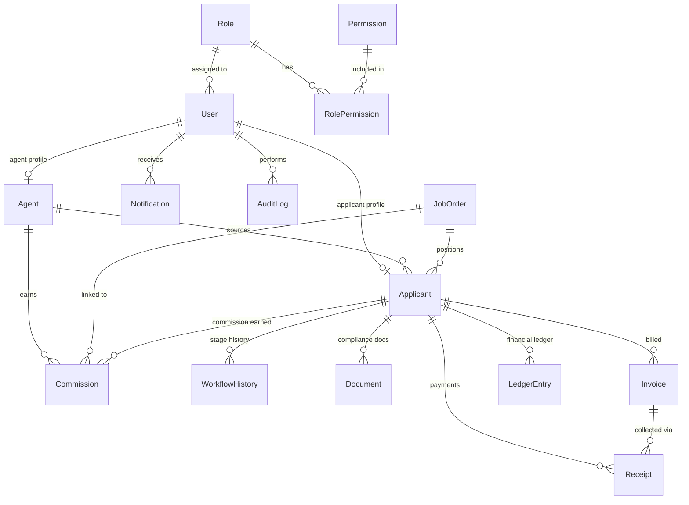

# 08 — Database Model Guide

This document explains every model in `prisma/schema.prisma`: its purpose, fields, relationships, and which modules use it.

---

## Configuration Notes

**Provider:** PostgreSQL  
**Prisma version:** 7  
**Connection URL:** Configured in `prisma.config.ts` (Prisma 7 requirement — not in schema.prisma)  
**Generated client output:** `generated/prisma/`  

---

## Enums

### WorkflowStage
Represents the recruitment pipeline stage of an applicant.

| Value | Meaning |
|-------|---------|
| `APPLIED` | Candidate has been registered |
| `INTERVIEWED` | Interview completed |
| `SELECTED` | Candidate selected for a job order |
| `MEDICAL_WAITING` | Awaiting medical examination |
| `MEDICAL_FIT` | Medically cleared |
| `MEDICAL_UNFIT` | Failed medical (recovery path available) |
| `TRAINING_COMPLETED` | Pre-departure training completed |
| `VISA_SUBMITTED` | Visa application submitted to embassy |
| `VISA_STAMPED` | Visa approved and stamped |
| `VISA_REJECTED` | Visa declined (recovery path available) |
| `TICKETED` | Air ticket purchased |
| `DEPLOYED` | Candidate has departed for overseas employment |

### DocumentType
| Value | Meaning |
|-------|---------|
| `PASSPORT` | Passport scan (gate: required for VISA_SUBMITTED) |
| `PHOTO` | Passport-size photograph |
| `CV` | Curriculum vitae |
| `MEDICAL_REPORT` | Medical fitness certificate (gate: required for MEDICAL_FIT) |
| `POLICE_CLEARANCE` | Police clearance certificate |
| `VISA_STICKER` | Visa stamp image (gate: required for VISA_STAMPED) |
| `AIR_TICKET` | Flight ticket (gate: required for TICKETED) |
| `OTHER` | Miscellaneous supporting document |

### DocumentStatus
| Value | Meaning |
|-------|---------|
| `PENDING_UPLOAD` | Document slot created but file not yet uploaded |
| `PENDING_VERIFICATION` | File uploaded, awaiting staff review |
| `VERIFIED` | Approved by Documentation Officer or Admin |
| `REJECTED` | Rejected by staff — requires re-upload |
| `EXPIRED` | Document has passed its expiry date |

### PaymentMethod
`CASH`, `BANK_TRANSFER`, `CHEQUE`, `MOBILE_BANKING`

### LedgerTransactionType
`INVOICE`, `RECEIPT`, `CREDIT_NOTE`, `DEBIT_NOTE`

### CommissionStatus
`ACCRUED`, `PAID`, `CANCELLED`

---

## Models

### Role
The master role definition. Roles are seeded (e.g. "Super Admin", "HR Officer") and referenced by User records.

| Field | Type | Notes |
|-------|------|-------|
| `id` | String (UUID) | Primary key |
| `name` | String | Unique role name (e.g. "Super Admin") |
| `description` | String? | Optional description |
| `createdAt` | DateTime | |
| `updatedAt` | DateTime | |

**Relations:** `users User[]`, `permissions RolePermission[]`  
**Used by:** Auth, RBAC Settings module  

---

### Permission
Individual permission codes that can be assigned to roles.

| Field | Type | Notes |
|-------|------|-------|
| `id` | String (UUID) | Primary key |
| `name` | String | Unique code (e.g. "VIEW_APPLICANTS") |
| `module` | String | Grouping label (e.g. "Applicant Management") |

**Relations:** `roles RolePermission[]`  
**Used by:** RBAC module, all API route handlers  

---

### RolePermission
Join table linking a Role to its Permissions.

| Field | Type | Notes |
|-------|------|-------|
| `roleId` | String | FK → Role.id |
| `permissionId` | String | FK → Permission.id |
| `createdAt` | DateTime | |

**Composite primary key:** `[roleId, permissionId]`  
**Used by:** `src/lib/rbac.ts` (getUserPermissions)  

---

### User
System user account. Every person who logs in has a User record. Users are linked to either an Agent profile, an Applicant profile, or neither (for pure staff roles).

| Field | Type | Notes |
|-------|------|-------|
| `id` | String (UUID) | Primary key |
| `email` | String | Unique, used for login |
| `passwordHash` | String | Argon2 hash |
| `fullName` | String | Display name |
| `phone` | String? | Optional |
| `roleId` | String | FK → Role.id |
| `isActive` | Boolean | `false` blocks login |
| `twoFactorSecret` | String? | Reserved for future 2FA |
| `createdAt` | DateTime | |
| `updatedAt` | DateTime | |

**Relations:** `role Role`, `agentProfile Agent?`, `applicantProfile Applicant?`, `notifications Notification[]`, `auditLogs AuditLog[]`  
**Used by:** Auth (login, refresh, me), all modules (for createdBy/changedBy references)  

---

### Agent
External recruitment partner profile. Linked one-to-one with a User account.

| Field | Type | Notes |
|-------|------|-------|
| `id` | String (UUID) | Primary key |
| `userId` | String | FK → User.id (unique, one agent per user) |
| `agentCode` | String | Unique shortcode (e.g. AGT-052) |
| `companyName` | String | Agency or company name |
| `licenseNo` | String? | Government license number |
| `tier` | String | "A", "B", or "C" (commission tier) |
| `phone` | String? | |
| `isActive` | Boolean | |

**Relations:** `user User`, `applicants Applicant[]`, `commissions Commission[]`  
**Used by:** Agents module, Commissions module, Applicant listing (agent boundary)  

**Note:** The `tier` field is stored but commission tier-based scaling is not yet implemented in the business logic.

---

### Applicant
The central model. Represents a candidate in the recruitment pipeline.

| Field | Type | Notes |
|-------|------|-------|
| `id` | String (UUID) | Primary key |
| `userId` | String? | FK → User.id — optional until applicant claims portal access |
| `agentId` | String? | FK → Agent.id — null if walk-in candidate |
| `jobOrderId` | String? | FK → JobOrder.id — linked when selected |
| `passportNumber` | String | Unique |
| `passportExpiry` | DateTime | |
| `nationality` | String | Default: "Bangladesh" |
| `fullName` | String | |
| `phone` | String | |
| `email` | String? | |
| `dateOfBirth` | DateTime | |
| `nidNumber` | String? | National ID number |
| `address` | String? | |
| `emergencyContact` | String? | |
| `isArchived` | Boolean | Soft delete flag |
| `archivedAt` | DateTime? | When archived |
| `trade` | String | Job category (e.g. Electrician, Welder) |
| `currentStage` | WorkflowStage | Current pipeline stage |
| `createdAt` | DateTime | |
| `updatedAt` | DateTime | |

**Relations:** `user User?`, `agent Agent?`, `jobOrder JobOrder?`, `workflows WorkflowHistory[]`, `documents Document[]`, `invoices Invoice[]`, `receipts Receipt[]`, `ledgerEntries LedgerEntry[]`, `commissions Commission[]`  
**Used by:** Every module  

**Indexes:** passportNumber, currentStage, agentId, isArchived  

**Important constraints:**
- `passportNumber` is unique — prevents duplicate candidates
- `onDelete: Restrict` on invoices/receipts/commissions — financial records block deletion
- `isArchived` provides soft delete without data loss

---

### JobOrder
Employment demand from an overseas employer.

| Field | Type | Notes |
|-------|------|-------|
| `id` | String (UUID) | Primary key |
| `orderNumber` | String | Unique (e.g. JO-KSA-2026-004) |
| `employerName` | String | |
| `country` | String | Destination country |
| `trade` | String | Job category |
| `salary` | Decimal | Monthly salary offer |
| `totalQuota` | Int | Total positions available |
| `allocatedQuota` | Int | Positions already filled |
| `commissionAmount` | Decimal | Default commission payout for this order |
| `status` | String | OPEN, CLOSED, COMPLETED |

**Relations:** `applicants Applicant[]`, `commissions Commission[]`  
**Used by:** Job Orders module, Dashboard (quota tracking), Commission accrue  

---

### WorkflowHistory
Immutable audit trail of every stage transition.

| Field | Type | Notes |
|-------|------|-------|
| `id` | String (UUID) | Primary key |
| `applicantId` | String | FK → Applicant.id |
| `oldStage` | WorkflowStage | Stage before transition |
| `newStage` | WorkflowStage | Stage after transition |
| `changedById` | String | User ID of staff who made the change |
| `changeNotes` | String? | Remarks (required for admin gate override) |
| `timestamp` | DateTime | |

**Used by:** Applicant dossier (workflow history timeline), audit trail  
**onDelete:** Restrict — cannot delete applicant while workflow history exists  

---

### Document
Compliance document uploaded for an applicant.

| Field | Type | Notes |
|-------|------|-------|
| `id` | String (UUID) | Primary key |
| `applicantId` | String | FK → Applicant.id |
| `documentType` | DocumentType | Enum: PASSPORT, MEDICAL_REPORT, etc. |
| `fileUrl` | String | Relative storage path (e.g. `storage/applicants/{id}/documents/{uuid}.pdf`) |
| `fileName` | String | Sanitized original filename |
| `status` | DocumentStatus | PENDING_VERIFICATION by default |
| `expiryDate` | DateTime? | Optional document expiry |
| `verifiedById` | String? | User ID of verifying staff |
| `createdAt` | DateTime | |
| `updatedAt` | DateTime | |

**Used by:** Documents module, stage gates (DOCUMENT_PREREQUISITES), download API  
**Security note:** `fileUrl` is a private storage path — never exposed directly to clients  

---

### Invoice
A billing document issued to an applicant.

| Field | Type | Notes |
|-------|------|-------|
| `id` | String (UUID) | Primary key |
| `applicantId` | String | FK → Applicant.id |
| `invoiceNo` | String | Unique (e.g. INV-2026-8988) |
| `amount` | Decimal | Total invoice amount |
| `outstanding` | Decimal | Remaining unpaid balance (decreases as receipts are recorded) |
| `dueDate` | DateTime | |
| `description` | String | e.g. "Processing Fee" |
| `createdAt` | DateTime | |

**Relations:** `applicant Applicant`, `receipts Receipt[]`  
**Used by:** Finance module, Receipts & Invoices page, Ledger  
**onDelete:** Restrict — invoices cannot be deleted while related records exist  

---

### Receipt
A payment recorded against an invoice.

| Field | Type | Notes |
|-------|------|-------|
| `id` | String (UUID) | Primary key |
| `applicantId` | String | FK → Applicant.id |
| `invoiceId` | String? | FK → Invoice.id — optional (can be a direct deposit) |
| `receiptNo` | String | Unique (e.g. REC-2026-0412) |
| `amountPaid` | Decimal | |
| `paymentMethod` | PaymentMethod | |
| `referenceNo` | String? | Bank transfer hash, cheque number |
| `receivedById` | String | User ID of Accounts Officer recording this |
| `createdAt` | DateTime | |

**Relations:** `applicant Applicant`, `invoice Invoice?`  
**Used by:** Finance module, Ledger, receipt voucher print  

---

### LedgerEntry
Double-entry accounting log. One entry per invoice (debit) and one per receipt (credit).

| Field | Type | Notes |
|-------|------|-------|
| `id` | String (UUID) | Primary key |
| `applicantId` | String | FK → Applicant.id |
| `transactionType` | LedgerTransactionType | INVOICE or RECEIPT |
| `referenceId` | String | Holds the Invoice.id or Receipt.id |
| `debit` | Decimal | Money owed (invoice) |
| `credit` | Decimal | Money paid (receipt) |
| `runningBalance` | Decimal | Cumulative balance after this entry |
| `timestamp` | DateTime | |

**Used by:** Accounts module, per-applicant ledger in dossier, portal  
**Note:** The running balance is calculated and stored at write time — no on-the-fly computation needed  

---

### Commission
Agent commission for placing a candidate.

| Field | Type | Notes |
|-------|------|-------|
| `id` | String (UUID) | Primary key |
| `agentId` | String | FK → Agent.id |
| `applicantId` | String | FK → Applicant.id |
| `jobOrderId` | String | FK → JobOrder.id |
| `amount` | Decimal | Commission amount |
| `status` | CommissionStatus | ACCRUED → PAID (or CANCELLED) |
| `payoutRef` | String? | Bank transfer reference when paid |
| `payoutDate` | DateTime? | |
| `createdAt` | DateTime | |

**Unique constraint:** `@@unique([agentId, applicantId])` — one commission per agent per candidate  
**Used by:** Commissions module, dashboard stats  

---

### Notification
In-app notification for a user.

| Field | Type | Notes |
|-------|------|-------|
| `id` | String (UUID) | Primary key |
| `userId` | String | FK → User.id |
| `title` | String | |
| `message` | String | |
| `isRead` | Boolean | Default false |
| `createdAt` | DateTime | |

**Used by:** Notifications module, topbar badge  
**onDelete:** Cascade — notifications deleted if user is deleted  

---

### AuditLog
Immutable record of every significant system action.

| Field | Type | Notes |
|-------|------|-------|
| `id` | String (UUID) | Primary key |
| `userId` | String? | FK → User.id — nullable for system actions |
| `roleName` | String? | Active role name at time of event |
| `actionType` | String | e.g. "TRANSITION_STAGE" |
| `tableName` | String | Affected database table |
| `recordId` | String? | Primary key of the affected record |
| `delta` | Json? | Before/after payload (JSON object) |
| `ipAddress` | String? | Client IP from x-forwarded-for |
| `timestamp` | DateTime | |

**Used by:** Audit Logs module  
**onDelete:** SetNull — user deletion sets userId to null (log is preserved)  

---

## Entity Relationship Diagram

