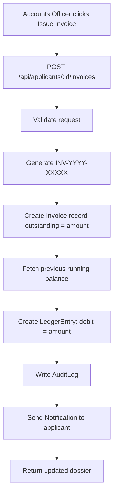
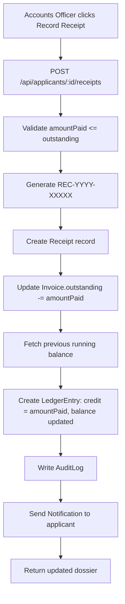
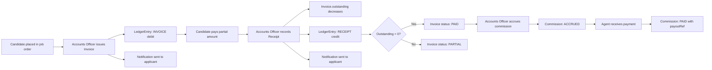

# 10 — Finance & Ledger Guide

This document explains the complete financial accounting system: invoices, receipts, the general ledger, commissions, and what audit/notification events are generated.

---

## Overview

The finance system uses a simplified **double-entry accounting model**:
- Every **invoice** creates a **debit** entry (money owed)
- Every **receipt** creates a **credit** entry (money paid)
- The **running balance** tracks how much each applicant still owes

Financial records are designed to be **immutable** — there is no delete or edit for invoices or receipts. This is intentional to preserve the audit trail.

---

## Invoice Creation

**API:** `POST /api/applicants/[id]/invoices`  
**Permission:** `RECORD_PAYMENT`  
**Who:** Accounts Officer  

### Steps (what happens in the database):

1. Validate request body (amount, dueDate, description)
2. Generate unique invoice number using sequence: `INV-{YYYY}-{5-digit-padded-number}` (e.g. `INV-2026-00042`)
3. Create `Invoice` record:
   - `amount` = total invoice amount
   - `outstanding` = same as `amount` initially (no payments yet)
   - `dueDate` = payment deadline
   - `description` = billing description
4. Fetch the previous running balance for this applicant (latest LedgerEntry)
5. Create `LedgerEntry` record:
   - `transactionType` = `INVOICE`
   - `referenceId` = Invoice.id
   - `debit` = invoice amount
   - `credit` = 0
   - `runningBalance` = previousBalance + amount
6. Write AuditLog (`CREATE_INVOICE`)
7. Create Notification for applicant user (if linked)

### Flow Diagram



---

## Receipt Recording

**API:** `POST /api/applicants/[id]/receipts`  
**Permission:** `RECORD_PAYMENT`  
**Who:** Accounts Officer  

### Steps (what happens in the database):

1. Validate request body (invoiceId, amountPaid, paymentMethod, referenceNo)
2. Generate unique receipt number: `REC-{YYYY}-{5-digit-padded-number}` (e.g. `REC-2026-00412`)
3. Fetch the linked Invoice
4. Validate: `amountPaid` should not exceed `invoice.outstanding`
5. Create `Receipt` record:
   - `invoiceId` = linked invoice
   - `amountPaid` = payment amount
   - `paymentMethod` = CASH / BANK_TRANSFER / CHEQUE / MOBILE_BANKING
   - `referenceNo` = optional bank reference
   - `receivedById` = logged-in Accounts Officer's user ID
6. Update `Invoice.outstanding` = `outstanding - amountPaid`
7. Fetch previous running balance
8. Create `LedgerEntry` record:
   - `transactionType` = `RECEIPT`
   - `referenceId` = Receipt.id
   - `debit` = 0
   - `credit` = amountPaid
   - `runningBalance` = previousBalance - amountPaid
9. Write AuditLog (`RECORD_RECEIPT`)
10. Create Notification for applicant user

### Invoice Status Computation

Invoice status is derived from `outstanding`:
| Condition | Status |
|-----------|--------|
| `outstanding === amount` | DUE |
| `outstanding > 0 && outstanding < amount` | PARTIAL |
| `outstanding === 0` | PAID |

This is computed at read time (in the GET endpoint), not stored as a separate field.

### Flow Diagram



---

## Ledger (Double-Entry Logic)

The `LedgerEntry` table implements a simplified double-entry bookkeeping system on a per-applicant basis.

### Structure of a LedgerEntry

```
| transactionType | referenceId | debit  | credit | runningBalance |
|-----------------|-------------|--------|--------|----------------|
| INVOICE         | inv-001     | 85000  | 0      | 85000          |
| RECEIPT         | rec-001     | 0      | 50000  | 35000          |
| INVOICE         | inv-002     | 30000  | 0      | 65000          |
| RECEIPT         | rec-002     | 0      | 65000  | 0              |
```

- **Debit** = money the applicant owes
- **Credit** = money the applicant has paid
- **Running balance** = cumulative debit - cumulative credit for this applicant

A running balance of **0** means the applicant is fully paid up.  
A positive running balance means they still owe money.

### Running Balance Calculation

The running balance is **calculated and stored at write time** in each API handler:

```ts
// In receipt API:
const previousEntry = await prisma.ledgerEntry.findFirst({
  where: { applicantId: id },
  orderBy: { timestamp: "desc" },
});
const previousBalance = previousEntry ? Number(previousEntry.runningBalance) : 0;
const newBalance = previousBalance - amountPaid;
```

This means balance retrieval is O(1) — no need to sum all entries at read time.

---

## Invoice Outstanding Update

The `Invoice.outstanding` field tracks how much of the invoice has not been paid. It is updated directly when a receipt is recorded:

```ts
await prisma.invoice.update({
  where: { id: invoiceId },
  data: { outstanding: { decrement: amountPaid } }
});
```

If multiple receipts are recorded against the same invoice, `outstanding` continues to decrease until it reaches 0 (PAID status).

---

## Receipt Voucher Preview

When a receipt is printed or previewed:
- The receipt number (REC-YYYY-XXXXX) is the primary reference
- The linked invoice number is shown for cross-reference
- The `receivedById` is resolved to the Accounts Officer's full name
- Payment method and reference number are displayed
- The amount paid and the date are the main output

**Current status:** Browser `window.print()` is used for print/preview. Server-side PDF generation (e.g. via Puppeteer or @react-pdf/renderer) is planned for a future phase.

---

## Commission Accrual

**API:** `POST /api/finance/commissions/accrue`  
**Permission:** `RECORD_PAYMENT`  

### Steps:

1. Validate: agentId, applicantId, jobOrderId, amount
2. Check: `Commission.@@unique([agentId, applicantId])` — prevents duplicate commissions
3. Create `Commission` record with `status: ACCRUED`
4. Write AuditLog (`ACCRUE_COMMISSION`)

**When to accrue:** Typically when an applicant is DEPLOYED, the Accounts Officer accrue the commission for the linked agent.

**Unique constraint:** Each agent can only earn one commission per placed candidate. The `@@unique([agentId, applicantId])` constraint prevents double-accrual.

---

## Commission Payout

**API:** `PATCH /api/finance/commissions/[id]/payout`  
**Permission:** `RECORD_PAYMENT`  

### Steps:

1. Validate: commission exists and is in ACCRUED status
2. Update `Commission`:
   - `status` = PAID
   - `payoutRef` = bank reference number
   - `payoutDate` = payment date
3. Write AuditLog (`PAYOUT_COMMISSION`)

### Commission Status Flow
```
ACCRUED → PAID    (normal payout)
ACCRUED → CANCELLED  (if candidate pulled back)
```

---

## Financial Summary Statistics

The general ledger API (`GET /api/accounts/ledger`) returns aggregate stats:

```json
{
  "stats": {
    "totalBilled": 5000000,       // Sum of all Invoice.amount
    "totalCollected": 3200000,    // Sum of all Receipt.amountPaid
    "totalOutstanding": 1800000,  // Sum of all Invoice.outstanding
    "totalCommissionsAccrued": 500000,  // Sum of ACCRUED commissions
    "totalLedgerEntries": 142
  }
}
```

The dashboard for Super Admin / Accounts Officer also shows: `pendingCommission` (ACCRUED), `totalCommissionPaid` (PAID), `totalCommissionAccrued` (ACCRUED + PAID).

---

## Audit Logs and Notifications Generated by Finance Events

| Event | AuditLog ActionType | Notification Recipient |
|-------|-------------------|----------------------|
| Invoice created | `CREATE_INVOICE` | Linked applicant user |
| Receipt recorded | `RECORD_RECEIPT` | Linked applicant user |
| Commission accrued | `ACCRUE_COMMISSION` | (none currently) |
| Commission paid | `PAYOUT_COMMISSION` | (none currently) |

---

## Why Financial Records Should Not Be Deleted

Financial records use `onDelete: Restrict` in the Prisma schema:

```prisma
applicant Applicant @relation(fields: [applicantId], references: [id], onDelete: Restrict)
invoice   Invoice?  @relation(fields: [invoiceId], references: [id], onDelete: SetNull)
```

This means:
- **An applicant with invoices/receipts/commissions cannot be deleted** — only archived
- **An invoice with linked receipts cannot be deleted** — receipts reference invoices
- **Financial ledger entries are never modified** — new entries are always appended

**Reasons:**
1. **Legal compliance** — financial records must be preserved for tax and audit purposes
2. **Audit trail integrity** — the ledger must balance; deleting records would break the running balance
3. **Dispute resolution** — if a candidate disputes a payment, the original records must exist
4. **Commission accountability** — agent commission records must be preserved

**Soft archive** is the correct way to "remove" a candidate from the active pipeline while preserving all their financial history.

---

## Finance Flow End-to-End


