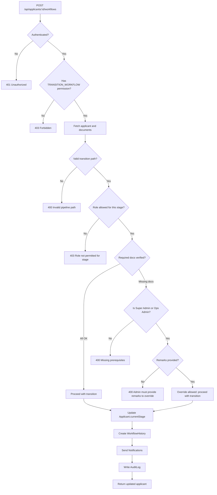
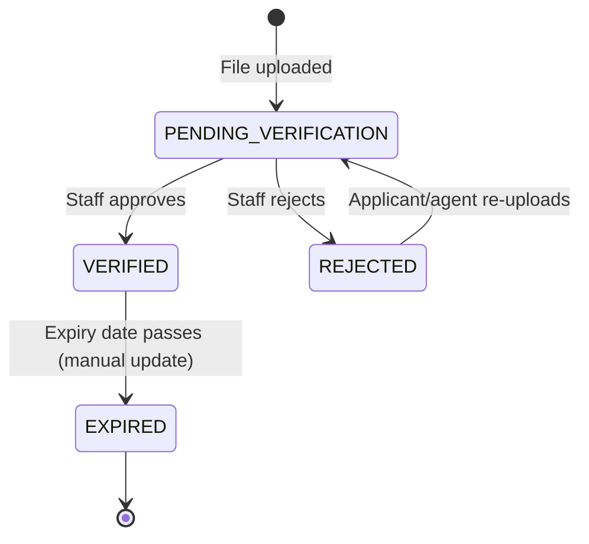

# 11 — Workflow, Documents & Compliance Guide

This document explains the applicant workflow pipeline, stage transition rules, document requirements, verification process, and compliance gates.

---

## Applicant Workflow Stages

The recruitment pipeline has 12 stages in order:

```
APPLIED → INTERVIEWED → SELECTED → MEDICAL_WAITING
→ MEDICAL_FIT (or MEDICAL_UNFIT) → TRAINING_COMPLETED
→ VISA_SUBMITTED → VISA_STAMPED (or VISA_REJECTED)
→ TICKETED → DEPLOYED
```

**Recovery paths:**
- `MEDICAL_UNFIT` → `MEDICAL_WAITING` (re-examine)
- `VISA_REJECTED` → `VISA_SUBMITTED` (reapply)
- `INTERVIEWED` → `APPLIED` (back to review)
- `SELECTED` → `INTERVIEWED` (reconsider)

All these transitions are defined in `src/lib/workflow-rules.ts` in the `ALLOWED_TRANSITIONS` map.

---

## Who Can Move Which Stages

| Role | Allowed Target Stages |
|------|----------------------|
| Super Admin | Any stage (with admin override if gate blocked) |
| Operations Admin | Any stage (with admin override if gate blocked) |
| HR Officer | APPLIED, INTERVIEWED, SELECTED only |
| Documentation Officer | MEDICAL_WAITING, MEDICAL_FIT, MEDICAL_UNFIT, TRAINING_COMPLETED only |
| Visa Officer | VISA_SUBMITTED, VISA_STAMPED, VISA_REJECTED, TICKETED, DEPLOYED only |
| Accounts Officer | ❌ Cannot transition any stages |
| Agent | ❌ Cannot transition any stages |
| Applicant | ❌ Cannot transition any stages |

This is enforced by `validateTransition(roleName, currentStage, nextStage)` in `src/lib/workflow-rules.ts` and validated at the API level in `POST /api/applicants/[id]/workflows`.

---

## Stage-Gate Prerequisites

Before certain stage transitions are allowed, specific documents must be **uploaded and verified** (status = VERIFIED). These gates prevent candidates from advancing without proper compliance documentation.

| Target Stage | Required Verified Document(s) |
|-------------|-------------------------------|
| MEDICAL_FIT | MEDICAL_REPORT |
| VISA_SUBMITTED | PASSPORT |
| VISA_STAMPED | VISA_STICKER |
| TICKETED | AIR_TICKET |
| DEPLOYED | PASSPORT + MEDICAL_REPORT + VISA_STICKER + AIR_TICKET |

Defined in `src/lib/workflow-rules.ts`:
```ts
export const DOCUMENT_PREREQUISITES: Record<string, string[]> = {
  MEDICAL_FIT: ["MEDICAL_REPORT"],
  VISA_SUBMITTED: ["PASSPORT"],
  VISA_STAMPED: ["VISA_STICKER"],
  TICKETED: ["AIR_TICKET"],
  DEPLOYED: ["PASSPORT", "MEDICAL_REPORT", "VISA_STICKER", "AIR_TICKET"],
};
```

### What Happens if a Gate is Blocked?

**For non-admin staff:** The API returns HTTP 400 with a message explaining which documents are missing:
```
"MEDICAL_REPORT must be uploaded and verified before transitioning candidate to MEDICAL_FIT."
```

**For Super Admin or Operations Admin:** They CAN bypass the gate — but only if they provide a non-empty `remarks` field. If they try to bypass without remarks, they also get a 400:
```
"As an Administrator, you must provide justification remarks to override this stage-gate block."
```

When an admin overrides a gate, the audit log records `overrideUsed: true` and `missingPrerequisites: [...]` in the delta field.

---

## Transition Validation Flow



---

## Document Upload

**API:** `POST /api/applicants/[id]/documents`  
**Content-Type:** multipart/form-data

### Upload Parameters
| Field | Required | Description |
|-------|----------|-------------|
| `file` | Yes | PDF, JPG, or PNG file |
| `documentType` | Yes | One of the DocumentType enum values |
| `expiryDate` | No | ISO date string (e.g. for passport expiry) |
| `remarks` | No | Optional upload notes |

### Upload Validation (in `src/lib/storage.ts`)
1. File size must be ≤ 5 MB
2. MIME type must be `application/pdf`, `image/jpeg`, or `image/png`
3. File extension must be `.pdf`, `.jpeg`, `.jpg`, or `.png`
4. File name is sanitized: only `[a-zA-Z0-9_-]` characters in the base name
5. A UUID-based unique filename is generated server-side to prevent guessing

### Storage Location
Files are stored at:
```
storage/applicants/{applicantId}/documents/{documentType}_{uuid}.{ext}
```

The `fileUrl` stored in the database is a relative path:
```
storage/applicants/abc-123/documents/passport_550e8400-e29b-41d4-a716.pdf
```

This path is **never exposed directly to clients**. All access goes through the authenticated download endpoint.

### Who Can Upload
- Super Admin / Operations Admin: any applicant
- HR Officer: any applicant (UPLOAD_DOCUMENT permission)
- Documentation Officer: any applicant (UPLOAD_DOCUMENT permission)
- Visa Officer: any applicant (UPLOAD_DOCUMENT permission)
- Agent: only own candidates (agentId boundary enforced)
- Applicant: only own profile (userId boundary enforced)
- Accounts Officer: ❌ does not have UPLOAD_DOCUMENT permission

---

## Document Verification / Rejection

**API:** `PATCH /api/applicants/[id]/documents/[docId]`  
**Permission:** `VERIFY_DOCUMENT`

### Verify a Document
```json
{ "status": "VERIFIED" }
```
- Sets `Document.status = VERIFIED`
- Sets `Document.verifiedById = logged-in user ID`
- Writes AuditLog (`VERIFY_DOCUMENT`)

### Reject a Document
```json
{ "status": "REJECTED", "remarks": "Signature is unclear, please re-upload" }
```
- Sets `Document.status = REJECTED`
- Writes AuditLog (`REJECT_DOCUMENT`) with remarks in delta

### Who Can Verify
- Super Admin / Operations Admin
- Documentation Officer (VERIFY_DOCUMENT permission)
- HR Officer: ❌ does not have VERIFY_DOCUMENT permission
- Visa Officer: ❌ does not have VERIFY_DOCUMENT permission
- Agent: ❌ cannot verify documents
- Applicant: ❌ cannot verify documents

---

## Secure Document Download

**API:** `GET /api/applicants/[id]/documents/[docId]/download`  
**Auth required:** Yes (Bearer token)

This endpoint:
1. Authenticates the request
2. Fetches the Document record from the database
3. Enforces boundary checks (Agent: own only; Applicant: own only)
4. Reads the file from the private `storage/` directory using the `fileUrl` from the database
5. Streams the file with the appropriate `Content-Type` header

**Why not serve files directly?** Serving files from a public static directory would allow anyone with a guessed URL to download any document. The authenticated endpoint ensures:
- Only logged-in users can download
- Agent and Applicant boundary checks are enforced
- The storage path is never exposed to the client

---

## Document Status Lifecycle



---

## Notifications and Audit Logs Generated

### When a document is uploaded:
- **AuditLog:** `UPLOAD_DOCUMENT` — includes original filename, file size, document type, expiry date
- **Notifications:** Created for Super Admin, Operations Admin, and Documentation Officer users:
  > "A new PASSPORT document has been uploaded for Ahmed Rahman and requires verification."

### When a document is verified:
- **AuditLog:** `VERIFY_DOCUMENT` — includes verifiedById, timestamp

### When a document is rejected:
- **AuditLog:** `REJECT_DOCUMENT` — includes rejection remarks

### When a stage gate passes:
- **AuditLog:** `TRANSITION_STAGE` — includes before/after stage, override info if used
- **Notifications:** Sent to linked applicant user and linked agent user

---

## Agent and Applicant Upload Boundaries

### Agent Upload Rules:
- Can only upload documents for candidates where `applicant.agentId === agent.id`
- Cannot verify or reject any document (lacks VERIFY_DOCUMENT permission)
- Cannot download documents for other agents' candidates

### Applicant Upload Rules:
- Can only upload documents for their own profile (`applicant.userId === userId`)
- Cannot verify or reject any document
- Can download documents from their own profile via the portal API (secure download URL)

### Example Boundary Enforcement in Code:
```ts
// In POST /api/applicants/[id]/documents

// Applicant boundary
if (roleName === "Applicant") {
  const userProfile = await prisma.user.findUnique({
    where: { id: userId },
    include: { applicantProfile: true },
  });
  if (userProfile?.applicantProfile?.id !== id) {
    return 403; // Cannot upload for other applicants
  }
}

// Agent boundary
else if (roleName === "Agent") {
  const agent = await prisma.agent.findUnique({ where: { userId } });
  if (!agent || applicant.agentId !== agent.id) {
    return 403; // Cannot upload for other agents' candidates
  }
}
```

---

## Compliance Gate Summary

```
Required documents before key stages:

APPLIED → ... → MEDICAL_FIT
  ✅ Required: MEDICAL_REPORT (status = VERIFIED)

TRAINING_COMPLETED → VISA_SUBMITTED
  ✅ Required: PASSPORT (status = VERIFIED)

VISA_SUBMITTED → VISA_STAMPED
  ✅ Required: VISA_STICKER (status = VERIFIED)

VISA_STAMPED → TICKETED
  ✅ Required: AIR_TICKET (status = VERIFIED)

TICKETED → DEPLOYED
  ✅ Required: PASSPORT + MEDICAL_REPORT + VISA_STICKER + AIR_TICKET (all VERIFIED)

Admin Override:
  Super Admin / Ops Admin can bypass gates with justification remarks.
  Override is recorded in AuditLog (overrideUsed: true, missingPrerequisites: [...]).
```
