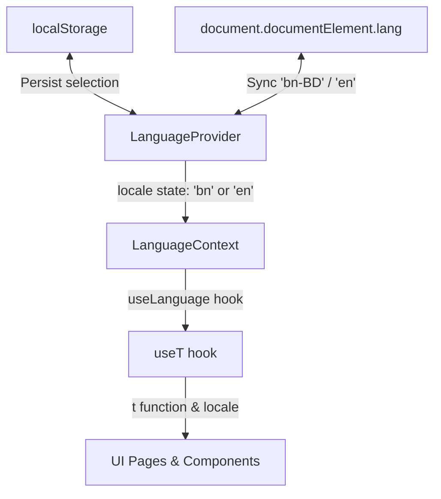

# 17 — Bangla Localization & Copy Guide

Welcome to the **VisaTek ERP** Bangla Localization and Copy Guide.

This document describes the technical architecture, translation standards, terminology rules, and developer guidelines for the **Bangla-First** design pattern implemented in VisaTek ERP.

---

## 1. Technical Architecture Overview

VisaTek ERP implements an client-side dynamic internationalization (i18n) model using React Context and custom hooks.



### Key Components

1. **`LanguageProvider` (`src/i18n/LanguageContext.tsx`)**
   - Manages the active language state (`locale: "bn" | "en"`).
   - Defaults to `"bn"` (Bangla-first) on first visit / when `localStorage` is clear.
   - Synchronizes `document.documentElement.lang` with `"bn-BD"` (for Bangla) and `"en"` (for English).
   - Persists user preferences dynamically in browser `localStorage` under the key `locale`.
   - Prevents interference with the theme settings (which use `theme`).

2. **`useT` Hook (`src/i18n/useT.ts`)**
   - Accesses the active language state.
   - Exposes a dynamic translation function `t(key: string, variables?: Record<string, string | number>)`.
   - Performs dot-notation key traversal (e.g., `t("common.save")`).
   - Implements automated **English fallback**: if a key is queried but missing in `bn.ts`, it automatically renders the English translation rather than throwing a runtime error or showing raw keys.
   - Handles **string interpolation**: replace tags like `{name}` or `{count}` using key-value pairs (e.g. `t("applicantPortal.hello", { name: "Asif" })` translates to `"হ্যালো, Asif"`).

3. **Strict TypeScript Synchronization (`src/i18n/locales/en.ts` & `bn.ts`)**
   - The type `TranslationKeys` is declared as `typeof en` in `src/i18n/useT.ts` or during dictionary typing.
   - This guarantees that both translation files **must maintain identical nested shapes**. If a key is added to `en.ts`, typescript compilation will fail if it's missing in `bn.ts`, and vice-versa.

---

## 2. Terminology Glossary Map

To ensure high professional quality and prevent confusing machine translation, VisaTek ERP enforces the following standardized vocabulary for Bangladeshi office operations.

| English Term | Recommended Bangla | Usage & Context Rules |
|--------------|-------------------|----------------------|
| **Applicant** | আবেদনকারী / প্রার্থী | Primary UI term is **আবেদনকারী** (Applicant). **প্রার্থী** (Candidate) can be used in explanatory/helper texts. |
| **Agent** | এজেন্ট | Refers to sourcing sub-agents or agency brokers. |
| **Job Order** | জব অর্ডার | Used for corporate foreign demand allocations. |
| **Demand Order** | চাহিদা অর্ডার | Used in formal consulate documentation contexts. |
| **Workflow** | প্রক্রিয়ার ধাপ | System recruitment logistics stages. |
| **Stage** | ধাপ | Individual milestone (e.g., Medical, Biometric). |
| **Document** | ডকুমেন্ট | All scanned compliance records. |
| **Verification** | যাচাই | Audit approval by attestation staff. |
| **Invoice** | ইনভয়েস / বিল | Billed package statements. |
| **Receipt** | রসিদ | Recorded incoming payments. |
| **Ledger** | লেজার / হিসাব খাতা | General accounting records. |
| **Outstanding** | বকেয়া | Unpaid billed accounts receivable. |
| **Commission** | কমিশন | Sourcing milestone payouts to agents. |
| **Audit Log** | অডিট লগ | Immutable record mutation history. |
| **Notification** | নোটিফিকেশন / সতর্কবার্তা | Real-time warnings or updates. |
| **Archive** | আর্কাইভ | Soft-archived file storage. |
| **Restore** | পুনরুদ্ধার | Restoring soft-archived candidate files. |
| **Deployed** | বিদেশে পাঠানো হয়েছে | The final milestone where candidate flies out. |

---

## 3. What NOT to Translate

Strict technical boundaries exist to prevent data matching errors, layout breaks, or system validation bugs:

> [!IMPORTANT]
> 1. **Do NOT Translate Database Enum Values**: Database values like `APPLIED`, `SELECTED`, `MEDICAL_FIT`, `PAID`, `DUE` must remain exactly as stored in Latin script. Only translate them **at display time** using `StatusBadge` or dynamic dictionary lookups like `t("statuses." + value)`.
> 2. **Do NOT Translate Unique Identifiers / Numeric Codes**: Keep Passport numbers, Phone numbers, NID cards, Invoice/Receipt reference codes, Sourcing Agent codes, Transaction IDs, and Dates in standard Latin numerals (e.g., `01712345678`, `EE1234567`, `10,000 BDT`). Converting them to Bangla digits will break alphanumeric search and excel sorting.
> 3. **Do NOT Translate Brand / Technical Names**: `VisaTek`, `OverseasERP`, and internal system paths (like `/api/applicants`, `/dashboard`) must always remain in English text.

---

## 4. UI Layout & CSS Spacing Guidelines

Bangla script contains conjunct characters and ascenders/descenders, making it taller and wider than equivalent English text. Keep these layout rules in mind to prevent broken dashboards:

* **Shun Huge Button Labels**: Use short, precise Bangla phrases. For example, instead of "আবেদনকারীর ফাইলটি আর্কাইভে স্থানান্তরিত করুন" (Move applicant file to archive), use "আর্কাইভ করুন" (Archive).
* **Responsive Spacing**: Ensure flexboxes have `flex-wrap` and grid layout columns have `min-width` boundaries to handle label wrapping without overlapping badges or tables.
* **Badges & Tables**: Status badges inside tables should use abbreviated labels (e.g. `আবেদন জমা` instead of `প্রার্থীর আবেদন সফলভাবে আমাদের সিস্টেমে নথিবদ্ধ করা হয়েছে`) to ensure they stay on a single line.
* **Form Helper Text**: When a field label requires long explanation, keep the label short and place the detailed context as a lightweight `p` element (using `text-[10px] text-slate-400 mt-1`) under the input field.

---

## 5. Developer Guardrails (Maintaining i18n Sync)

To ensure the application remains perfectly localized as it grows, follow these mandatory development protocols:

### A. Never Write Hardcoded Strings in JSX
Instead of writing:
```tsx
// ❌ WRONG
<h3>Account Security Details</h3>
```
Write:
```tsx
//  RIGHT
const { t } = useT();
<h3>{t("security.title")}</h3>
```

### B. Dynamic Enum Translation Pattern
When rendering database status variables, do not use static maps in files. Use the dynamic `t` resolver:
```tsx
//  RIGHT
<StatusBadge status={applicant.currentStage} />
```
The `StatusBadge` component automatically resolves this using `{t("workflow." + status)}` or `{t("statuses." + status)}`.

### C. Keeping Locales in Perfect Sync
Every time you add a translation key to `src/i18n/locales/en.ts`, you **must** add the exact same key to `src/i18n/locales/bn.ts`.
```typescript
// src/i18n/locales/en.ts
export const en = {
  settings: {
    title: "Settings",
  }
}

// src/i18n/locales/bn.ts
export const bn = {
  settings: {
    title: "সেটিংস",
  }
}
```

---

## 6. QA i18n Checklist

Use this quick checklist during code reviews or feature development:

- [ ] Does the page load in Bangla by default when `localStorage` is cleared?
- [ ] Does `document.documentElement.lang` toggle to `"bn-BD"` in Bangla and `"en"` in English?
- [ ] Are all passport, phone, and money digits kept in standard Latin numerals to preserve searchability?
- [ ] Do tables, forms, and cards look pristine on mobile/tablet widths without overflow or clipped text?
- [ ] Are roles, statuses, and workflow stages translated correctly on display, while staying unmodified in the database?
