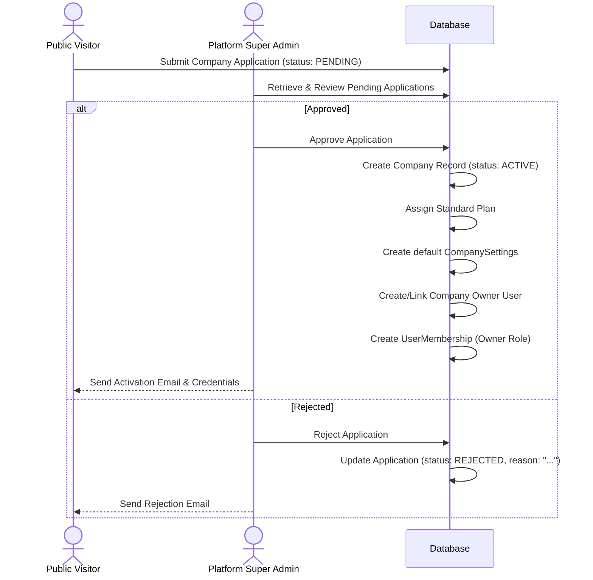
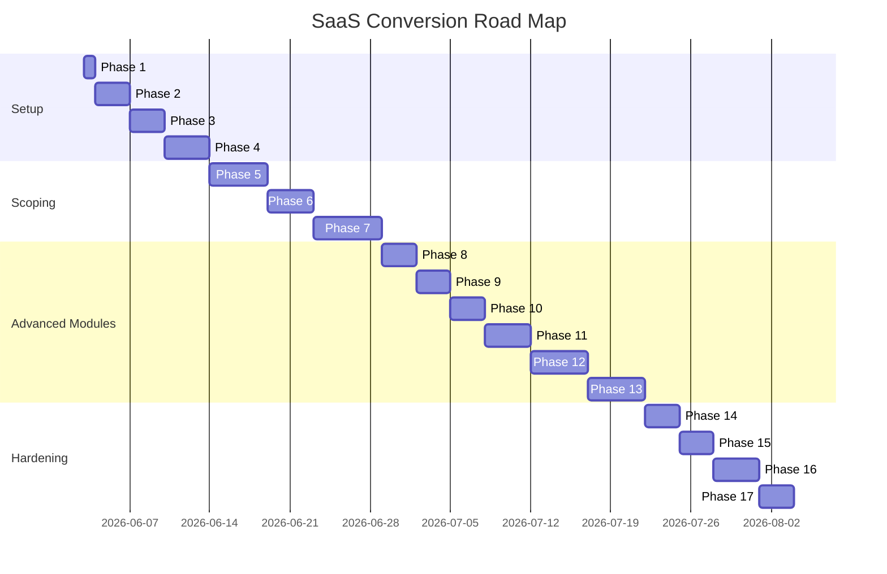

# 18 — SaaS Conversion Plan

This document outlines the architectural plan, database changes, role updates, migration strategies, and implementation phases for converting the single-company **VisaTek ERP** into a multi-company SaaS product.

---

## 1. Product Concept

The SaaS platform operates as a multi-tenant application where multiple recruitment agencies, manpower agencies, and worker-sending agencies use their own isolated ERP instances. The hierarchy and actors of the SaaS ecosystem are defined as follows:

* **Platform Owner / SaaS Owner**: The organization or entity running and managing the SaaS platform as a service.
* **Platform Super Admin**: Platform-level administrators who manage company applications, plans, global settings, billing cycles, and system deactivations.
* **Company / Tenant**: The client organization (manpower agency, etc.) operating their business within an isolated space.
* **Company Owner**: The primary administrator of a tenant company (usually the one who applied). They hold full permissions within their tenant, including billing, subscription control, and workspace setup.
* **Company Users**: Employees of a tenant company who perform operational tasks (e.g., HR, Documentation, Visa, Accounts).
* **Agents**: External recruitment partners who supply candidates. They are associated with a specific company and can log in to view their candidates and accrued commissions.
* **One-Level Sub-Agents**: Sub-agents who work under an Agent. They can submit and track their own applicants but do not see the parent Agent's other candidates or other agents' data.
* **Applicants**: Candidates in the recruitment pipeline who log in to their self-service portal to view progress, upload documents, and download receipts.
* **Leads / Hotline / CRM Contacts**: Potential candidates, walk-ins, or callers who are tracked in the CRM module before being qualified as Applicants.

---

## 2. Company Application & Approval Flow

To ensure high-quality and compliant agencies on the platform, new companies cannot register and immediately access the system. They must undergo a manual verification and approval workflow:



### Process Detail
1. **Public Application**: A visitor submits fields (e.g., agency name, license details, owner email, phone, trade interest). Status starts as `PENDING`.
2. **Platform Review**: Platform Super Admins review the business credibility (e.g., license status).
3. **Approval**:
   * If approved: The database updates `CompanyApplication` status to `APPROVED`, creates a new `Company` (status: `ACTIVE`), assigns the `Standard` plan, initializes basic configurations in `CompanySettings`, inserts/updates the `User` record for the owner, and maps them to a `UserMembership` with a `Company Owner` role.
   * If rejected: Application status changes to `REJECTED`, the rejection reason is saved, and no company is created.

---

## 3. SaaS Role Separation

The conversion requires strict separation of platform-level roles and tenant-level roles.

### Platform-Level Roles
* **Platform Super Admin**: Has access only to global administration views (manage companies, applications, subscription billing, and plans). They do not participate in any company-level workflows (they cannot view a specific company's ledger or applicants unless using an impersonation context).

### Company-Level Roles (Tenant Scope)
The current "Super Admin" role in single-tenant mode becomes the **Company Owner** or **Company Admin / Manager**.

* **Company Owner**: Full administrative control within a single tenant (billing, user management, settings).
* **Company Admin / Manager**: General manager of operations under the Owner.
* **HR / Recruiting Officer**: Handles applicant intake, interviews, and early pipeline stages.
* **Documentation Officer**: Verifies documents, manages medical queues, and tracks compliance.
* **Visa / Processing Officer**: Coordinates visa submissions, stamps, and ticket logs.
* **Accounts Officer**: Manages invoicing, receipts, commissions, and double-entry general ledger.
* **CRM / Call Officer**: Tracks hotline leads, calls, and conversions.
* **Agent**: Accesses own applicants and sub-agent applicants.
* **Sub-agent**: Accesses own applicants.
* **Applicant**: Accesses applicant portal for their own progress dossier.

---

## 4. Tenant Isolation Rules

To safely isolate tenant data, we must enforce the following technical constraints across all APIs and queries:

* **Scope Column**: Every operational business table must contain a `companyId` foreign key referencing the `Company` table.
* **Never Trust Input**: API routes must never read `companyId` from client payloads (JSON body or query params) for writes. The `companyId` must be derived solely from the validated session JWT (which contains the active membership context).
* **Mandatory Queries Scoping**: All Prisma read queries (`findMany`, `count`, `aggregate`, `groupBy`) must include `where: { companyId }`.
* **Compound Detail Verification**: All detailed queries and mutations (`findUnique`, `update`, `delete`) must verify matches on both the entity `id` and the `companyId` to prevent ID-guessing attacks across tenants (e.g., `where: { id_companyId: { id, companyId } }` or logical AND).
* **Agent Hierarchical Boundaries**: Agents can only query applicants where `applicant.agentId == agent.id` or `applicant.agent.parentAgentId == agent.id` (covering sub-agent candidates).
* **Sub-agent Boundaries**: Sub-agents can only query applicants where `applicant.agentId == subAgent.id`.
* **Applicant Boundaries**: An applicant's JWT only authorizes access to their own record (`userId` lookup) and filters all portal sub-requests by their specific ID.
* **Suspended Tenant Guard**: If a `Company` has its status changed to `SUSPENDED`, all authentication requests must fail, and active sessions must reject requests immediately.

---

## 5. Data Model Plan

The following new or updated models are proposed for the SaaS database schema:

```mermaid
classDiagram
    class SaaSPlan {
        String id
        String name
        Decimal basePrice
        Int maxApplicants
        Boolean isActive
    }

    class Company {
        String id
        String name
        String status
        DateTime createdAt
    }

    class CompanySubscription {
        String id
        String companyId
        String planId
        DateTime startDate
        DateTime endDate
        String billingCycle
    }

    class CompanySettings {
        String id
        String companyId
        String themePreference
        String customBrandingUrl
    }

    class CompanyApplication {
        String id
        String agencyName
        String ownerEmail
        String status
        String remarks
        String rejectionRemarks
    }

    class UserMembership {
        String id
        String userId
        String companyId
        String roleId
        Boolean isActive
    }

    SaaSPlan ||--o{ CompanySubscription : "governs"
    Company ||--o{ CompanySubscription : "subscribes"
    Company ||--o| CompanySettings : "configures"
    Company ||--o{ UserMembership : "employs"
    CompanyApplication ..> Company : "creates on approval"
```

### Detail of Proposed Models

#### 1. `SaaSPlan`
* **Purpose**: Defines available service tiers (currently seeded with "Standard").
* **Key Fields**: `id`, `name`, `basePrice`, `maxApplicants`, `maxUsers`, `features` (JSON).
* **Relationships**: Linked to `CompanySubscription`.

#### 2. `CompanyApplication`
* **Purpose**: Stores inbound registration applications waiting for review.
* **Key Fields**: `id`, `agencyName`, `ownerName`, `ownerEmail`, `ownerPhone`, `licenseNumber`, `status` (`PENDING`, `APPROVED`, `REJECTED`), `rejectionRemarks`.
* **Relationships**: Triggers creation of `Company` and initial `User`/`UserMembership` when status transitions to `APPROVED`.

#### 3. `Company`
* **Purpose**: Core tenant model representing an agency client.
* **Key Fields**: `id`, `name`, `licenseNo`, `status` (`PENDING`, `ACTIVE`, `SUSPENDED`, `INACTIVE`), `createdAt`, `updatedAt`.
* **Relationships**: Subscriptions, Settings, Memberships, and all company-level business resources.

#### 4. `CompanySubscription`
* **Purpose**: Tracks a tenant's active plan, payment period, and expiration date.
* **Key Fields**: `id`, `companyId`, `planId`, `startDate`, `endDate`, `status` (`ACTIVE`, `EXPIRED`, `CANCELLED`).
* **Relationships**: Belongs to `Company`, references `SaaSPlan`.

#### 5. `CompanySettings`
* **Purpose**: Holds tenant-specific system settings and preferences.
* **Key Fields**: `id`, `companyId`, `timezone`, `locale`, `receiptHeader`, `logoUrl`.
* **Relationships**: One-to-one with `Company`.

#### 6. `UserMembership`
* **Purpose**: Bridges users to multiple companies (supporting consultants/owners with multi-tenant access) and holds company-specific roles.
* **Key Fields**: `id`, `userId`, `companyId`, `roleId`, `isActive`.
* **Relationships**: Belongs to `User`, `Company`, and `Role`.

#### 7. `Agent` (Updated)
* **Purpose**: Supports hierarchical parent agent scoping.
* **Key Fields**: Added `parentAgentId` (optional, pointing back to another `Agent`).
* **Relationships**: Self-referencing relationship representing agent-to-sub-agent hierarchy.

#### 8. `Lead` & `LeadActivity`
* **Purpose**: CRM contact tracking before conversion to Applicants.
* **Key Fields**: `id`, `companyId`, `fullName`, `phone`, `source`, `status` (`NEW`, `CONTACTED`, `QUALIFIED`, `LOST`), `assignedToId`.

#### 9. `CommissionRule` & `CommissionEvent`
* **Purpose**: Rules representing dynamic commission schemes that do not retroactively alter locked payouts.
* **Key Fields**: `id`, `companyId`, `jobOrderId`, `agentTier`, `percentage`, `flatAmount`.
* **Relationships**: Resolves automatically to compile `Commission` records.

---

## 6. Existing Tables That Need companyId

The following tables contain operational business data and must be migrated to include `companyId` (along with standard database relations and indexes):

* **`Agent`**
* **`Applicant`**
* **`JobOrder`**
* **`WorkflowHistory`**
* **`Document`**
* **`Invoice`**
* **`Receipt`**
* **`LedgerEntry`**
* **`Commission`**
* **`Notification`**
* **`AuditLog`**

### Role / Permission Scoping Design
* **Phase 1**: Roles and permissions will remain **global templates** loaded by the system.
* **Phase 2**: Future enhancements can copy templates to a tenant-scoped space if custom role definitions are required per company.

---

## 7. Unique Constraint Migration Plan

Single-tenant tables commonly use global unique constraints. In a multi-company SaaS, these constraints must be scoped to the tenant to allow different agencies to have overlapping numbering schemes:

* **`Agent.agentCode`**: Must be unique *per company*. Change `unique: true` to a compound index: `@@unique([companyId, agentCode])`.
* **`Applicant.passportNumber`**: Depending on country requirements, it can be unique per company or global. We will migrate to `@@unique([companyId, passportNumber])`.
* **`JobOrder.orderNumber`**: Unique *per company*: `@@unique([companyId, orderNumber])`.
* **`Invoice.invoiceNo`**: Unique *per company*: `@@unique([companyId, invoiceNo])`.
* **`Receipt.receiptNo`**: Unique *per company*: `@@unique([companyId, receiptNo])`.

### Global Uniqueness Exception
* **`User.email`**: Must remain globally unique. This ensures users maintain one credential context and can toggle between multiple companies they are members of via `UserMembership`.

---

## 8. Migration Strategy

To safely transition production databases without risking data loss:

1. **Company Backfill Foundation**: Create a "Default Tenant" representation in the `Company` table.
2. **Introduce Nullable Scopes**: Add `companyId` as a nullable field to all target tables.
3. **Execute Update Queries**: Run queries to set `companyId` to the Default Tenant ID for all existing records.
4. **Enforce Strict Constraint**: Alter the table fields to make `companyId` required/non-nullable and configure foreign keys.
5. **Membership Migration**:
   * Create `UserMembership` rows for every existing `User` pointing to the Default Tenant.
   * Retain `User.roleId` as a fallback during active migration.
   * Update auth middleware to prioritize membership records.
   * Drop the deprecated `User.roleId` column once API security validation is completed.

---

## 9. Storage Isolation Plan

The local storage path must isolate tenant files physically and programmatically.

### Path Pattern
`companies/{companyId}/applicants/{applicantId}/documents/{documentId-or-filename}`

### Security Enforcement Rules
* **Upload**: The storage module reads `companyId` from the validated user session context. It is impossible to write to another company's directories.
* **Download**: The download endpoint must fetch the `Document` object, join the `Applicant` relation, check that `applicant.companyId === user.companyId`, and *only then* open the storage stream.
* **Role Check validation**: Additional filters verify that agents can only view matching applicants, and applicants can only download files belonging to their user account.

---

## 10. Development Phases



---

## 11. Do Not Break These Rules

* **Do not add CRM before tenant isolation**: Isolating operational data takes precedence over implementing additional modules.
* **Do not add sub-agent features before companyId scoping**: Agent logic must operate correctly within isolated scopes first.
* **Do not query records by ID only**: Always join or search matching conditions on `companyId` (e.g., `where: { id, companyId }`).
* **Do not trust frontend checks**: The client application interface serves UX purposes only. All authorization and verification must execute in API handlers.
* **Do not expose platform administration routes**: Paths matching `/api/platform/...` or `/platform/...` must reject sessions that do not possess a `Platform Super Admin` role.
* **Do not allow suspended companies into ERP**: All tenant endpoints must perform active company status validations before processing transactions.
* **Do not allow instant registration**: Public applications must remain in `PENDING` states until manually approved by platform admins.
* **Do not dynamically alter historical financials**: Ensure commission adjustments do not retroactively modify historical financial logs (`LedgerEntry` or already accrued/paid `Commission` records).
