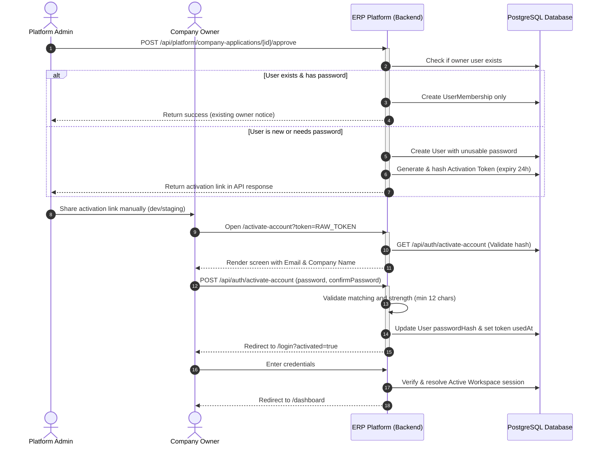

# Company Owner Activation and First Login Flow

This document details the architecture, data models, API endpoints, and user experience for the safe activation of new Company Owners and their first-time login workflow.

---

## 1. Flow Overview

When a Platform Admin approves a company application, the owner user must be created (if new) or associated (if existing). To prevent unauthorized access and secure password creation, a cryptographically secure, time-limited activation token is generated for new owners.



---

## 2. Database Model

The `AccountActivationToken` model stores the SHA-256 hashes of activation tokens to prevent token compromise via database leaks.

```prisma
model AccountActivationToken {
  id          String   @id @default(cuid())
  userId      String
  companyId   String?
  tokenHash   String   @unique
  type        String   @default("COMPANY_OWNER_ACTIVATION")
  expiresAt   DateTime
  usedAt      DateTime?
  createdAt   DateTime @default(now())

  // Relations
  user        User     @relation(fields: [userId], references: [id])
  company     Company? @relation(fields: [companyId], references: [id])

  @@index([userId])
  @@index([companyId])
  @@index([expiresAt])
}
```

---

## 3. Token Security & Hashing Constraints

1. **Deterministic Hashing**: Only the SHA-256 hash of the cryptographically random token (`crypto.randomBytes(32)`) is stored in the database. Raw tokens are never logged, stored, or visible inside DB backups.
2. **Single-Use Enforcement**: The `usedAt` field is verified to be `null` on validation and set to the current timestamp atomically in a transaction upon password submission. Subsequent uses of the same token will fail.
3. **Expiration Bound**: Tokens have a hard-coded expiry of 24 hours. The validation check verifies `expiresAt > NOW()`.
4. **Unusable Initial Password**: New owner accounts are created with a long, randomly generated unusable password hash (`crypto.randomUUID() + "-" + crypto.randomUUID()`) to prevent standard login attempts prior to activation.

---

## 4. API Endpoint Contracts

### GET `/api/auth/activate-account?token=...`
* **Visibility**: Public
* **Purpose**: Validate token validity and return basic info to populate the activation screen.
* **Response (Success)**:
  ```json
  {
    "email": "owner@company.com",
    "companyName": "Acme Manpower Ltd"
  }
  ```
* **Response (Error - Generic)**:
  ```json
  {
    "error": "Invalid or expired activation link."
  }
  ```

### POST `/api/auth/activate-account`
* **Visibility**: Public
* **Purpose**: Mark token as used, hash new password using Argon2, and update User record.
* **Payload**:
  ```json
  {
    "token": "RAW_TOKEN_STRING",
    "password": "StrongPassword2026!",
    "confirmPassword": "StrongPassword2026!"
  }
  ```
* **Validation Rules**:
  * Minimum 12 characters.
  * Passwords must match.
* **Response (Success)**:
  ```json
  {
    "success": true,
    "message": "Account successfully activated. Please log in."
  }
  ```

---

## 5. Login Redirection Behavior

* Once the account is activated and the user logs in, the platform resolves their `activeCompanyId` via the `UserMembership` created on approval.
* The backend assigns standard tenant-scoped claims and RBAC permissions inside the JWT.
* The frontend context routes the activated user directly to `/dashboard`.
* The dashboard displays only the company's records due to the pre-existing tenant-scoped API constraints.

---

## 6. Known Limitations & Future Roadmap

* **Manual Delivery**: Currently, the Platform Admin copies the activation link from the admin dashboard and delivers it manually to the client.
* **Email Service Integration**: The future production flow will integrate an SMTP/email service provider to send invitation and activation links automatically.
* **No Resend UI**: Currently, there is no UI to regenerate or resend the activation token. It is planned for a future phase on the Company Applications list screen.
