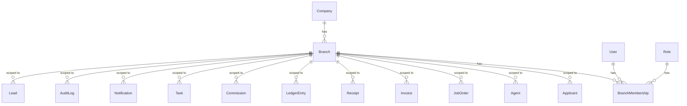

# Branching Foundation & CRM Architecture Roadmap

This document outlines the architecture design for implementing branch support and preparing the CRM module in VisaTek ERP.

---

## 1. Why Branch is Below Company (Multi-Branch Tenant Isolation)

In VisaTek ERP, the top-level boundary for data isolation is the **Company (Tenant)**. A company represents a complete legal and financial entity using the SaaS platform.
A **Branch** is a subdivision of a company (e.g., Dhaka Office, Sylhet Office, Chittagong Office). 

### Hierarchy
```
           +-----------------------------------------+
           |             Company (Tenant)            |
           +-----------------------------------------+
                                |
        +-----------------------+-----------------------+
        |                                               |
+---------------+                               +---------------+
| Branch: Dhaka |                               | Branch: Sylhet|
+---------------+                               +---------------+
```

### Rationale
- **Legal & Accounting Entity**: All branches share the same parent Company configuration, SaaS billing plan, agent list foundations, and overall ledger boundaries, although reports can be scoped to specific branches.
- **Unified Switcher**: A company user might belong to multiple branches or be promoted to oversee multiple branches. Keeping Branch as a sub-resource under Company prevents fragmentation of User credentials.
- **Resource Sharing**: Job orders can be shared or distributed across branches, but remain isolated within the single parent company.

---

## 2. Branch Access Rules & Permission Model

Branch access restricts staff visibility and write operations to their designated office(s) to maintain operational focus and prevent leakage of candidate/finance data between physical office teams.

### User Personas & Access Scope
1. **Company Owner / Super Admin / Company Admin**:
   - Access: All branches.
   - Permissions: `VIEW_ALL_BRANCH_DATA`, `VIEW_BRANCHES`, `CREATE_BRANCH`, `UPDATE_BRANCH`, `SUSPEND_BRANCH`, `VIEW_BRANCH_USERS`, `ASSIGN_BRANCH_USERS`.
   - Data Scope: Sees aggregate and granular data across all branches.
2. **Branch Manager**:
   - Access: Assigned branch(es).
   - Permissions: `VIEW_OWN_BRANCH_DATA`, `VIEW_BRANCH_USERS`, and optionally `ASSIGN_BRANCH_USERS` (within their branch).
   - Data Scope: Can view/manage data belonging to their assigned branch.
3. **Branch-based Staff (e.g., HR, Documentation, Visa, Accounts Officers)**:
   - Access: Assigned branch only.
   - Permissions: `VIEW_OWN_BRANCH_DATA`.
   - Data Scope: Can only see and manipulate records marked with their specific `branchId`.

### Transition of Global Role vs. Branch-Level Scoping
Users retain a company-level role membership (`UserMembership`). However, they are assigned to branches via the `BranchMembership` table. 
- If a user has `VIEW_ALL_BRANCH_DATA`, they bypass the branch scoping restriction.
- Otherwise, they are constrained to only view/update records that match their active/assigned `branchId`(s).

---

## 3. Recommended Data Model

The database additions introduce two central tables, status enums, and nullable `branchId` linkages across core tables:

### Diagram


### Field Definitions

#### Branch Table
- `id` (String, cuid): Primary key
- `companyId` (String): Parent company link
- `name` (String): e.g. "Dhaka Office" or "Head Office"
- `code` (String): Unique code within company e.g. "HO", "DHK"
- `city`, `address`, `phone`, `email` (String, optional)
- `isHeadOffice` (Boolean): Identifies the main office of the company (default `false`)
- `status` (BranchStatus): Enum (`ACTIVE`, `SUSPENDED`)

#### BranchMembership Table
Tracks user assignments to specific branches with localized role overrides:
- `id` (String, cuid): Primary key
- `userId` (String): Linked user
- `companyId` (String): Parent company
- `branchId` (String): Designated branch
- `roleId` (String): Local role assigned for this branch
- `status` (MembershipStatus): Enum (`ACTIVE`, `SUSPENDED`, `INVITED`)
- `isBranchManager` (Boolean): Designates leadership status (default `false`)

---

## 4. Branch-Aware API Scoping Rules

To prevent branch isolation bypasses:
1. **Query Filtering (`GET` lists)**:
   - Check if user has `VIEW_ALL_BRANCH_DATA`.
   - If **yes**, return all records under `activeCompanyId`.
   - If **no**, fetch the user's active branch membership(s) and filter by matching `branchId` (e.g. `where: { companyId: activeCompanyId, branchId: { in: userBranchIds } }`).
2. **Mutation Validation (`POST`, `PUT`, `DELETE`)**:
   - Verify the `branchId` provided in the request body belongs to the active company.
   - Verify the user has access to that specific `branchId` (either via `VIEW_ALL_BRANCH_DATA` or matching `BranchMembership`).
   - Throw a `403 Forbidden` if they try to write to/reference a branch they don't belong to.
3. **Record Owner Validation**:
   - Before mutating an existing record, check its current `branchId`. Ensure the user is authorized for that branch.

---

## 5. Branch-Aware Dashboard & Report Rules

- **Default State**: Staff dashboard queries automatically filter counters and charts to show only data for their assigned branch.
- **Admin View**: Company Owners/Admins get a **Branch Switcher/Filter dropdown** in the dashboard UI header. Selecting "All Branches" shows aggregated totals, while selecting a specific branch updates the stats to that office.
- **Reporting**: Financial ledger extracts, candidate pipeline counts, and agent commission reports should include a mandatory/optional `branchId` column and filter option.

---

## 6. CRM Module Plan

To prepare for CRM integration, we plan a `Lead` capture pipeline. Leads act as the intake stage before candidates become formal `Applicants`.

### Lead Table Properties
- `id` (String, CUID)
- `companyId` (String)
- `branchId` (String, optional)
- `fullName` (String)
- `phone` (String)
- `email` (String, optional)
- `source` (String): e.g. "Facebook", "Walk-in", "Agent Referral"
- `interestedCountry` (String, optional)
- `interestedTrade` (String, optional)
- `interestedJobOrderId` (String, optional): Relation to `JobOrder`
- `status` (LeadStatus): e.g. `NEW`, `CONTACTED`, `QUALIFIED`, `LOST`, `CONVERTED`
- `assignedToId` (String, optional): Relation to `User` (branch staff)
- `nextFollowUpAt` (DateTime, optional)
- `convertedApplicantId` (String, optional): Link to `Applicant` if qualified
- `notes` (String, optional)
- `createdAt`, `updatedAt` (DateTime)

### CRM Flow
```
[New Lead] -> [Assign to Branch Staff] -> [Log Activities & Notes] -> [Set Next Follow-Up] -> [Qualify / Convert to Applicant]
```

---

## 7. Safe Implementation Phases

- **Phase 1 (Completed)**: Foundation Setup.
  - Implement tables (`Branch`, `BranchMembership`).
  - Add optional `branchId` to core tables.
  - Backfill all existing records to the default "Head Office" (`HO`) for each company.
  - Seed branch permissions and define scoping helpers.
- **Phase 2 (Completed)**: UI and API Integration.
  - Created Branch settings pages (CRUD for branches, branch membership list).
  - Updated API endpoints to consume scoping helpers.
  - Adapted dashboard totals to filter by active branch context.
  - Integrated branch selector UI in Topbar.
  - Updated PDF/CSV exports to support branch scoping and columns.
- **Phase 3 (Next)**: CRM Module & Lead Pipeline.
  - Add `Lead` table and API.
  - Build Lead management board, notes logging, and conversion wizard.

---

## 8. Implemented Branch Routes & APIs

### API Routes
1. `GET /api/company/branches` - List company branches. Enforces `VIEW_BRANCHES`.
2. `POST /api/company/branches` - Create a branch. Enforces `CREATE_BRANCH`.
3. `GET /api/company/branches/[id]` - Retrieve branch details. Enforces `VIEW_BRANCHES`.
4. `PATCH /api/company/branches/[id]` - Update branch details. Enforces `UPDATE_BRANCH`.
5. `POST /api/company/branches/[id]/suspend` - Suspend a branch. Enforces `SUSPEND_BRANCH`.
6. `POST /api/company/branches/[id]/reactivate` - Reactivate a branch. Enforces `SUSPEND_BRANCH` or `UPDATE_BRANCH`.
7. `GET /api/company/branches/[id]/users` - List branch memberships. Enforces `VIEW_BRANCH_USERS`.
8. `POST /api/company/branches/[id]/users` - Map user to branch. Enforces `ASSIGN_BRANCH_USERS`.
9. `PATCH /api/company/branches/[id]/users/[branchMembershipId]` - Update role/manager status. Enforces `ASSIGN_BRANCH_USERS`.
10. `DELETE /api/company/branches/[id]/users/[branchMembershipId]` - Remove user from branch. Enforces `ASSIGN_BRANCH_USERS`.

### UI Routes
- `/settings/branches` - Branch management list view.
- `/settings/branches/new` - Create branch form.
- `/settings/branches/[id]` - Branch details dashboard and member assignments view.
- `/settings/users/invite` - Updated to support branch mapping on user creation.

---

## 9. Known Risks & Mitigation

- **Risk**: API leakage during transition where old endpoints fail to filter by `branchId`.
  - *Mitigation*: The database schema adds `branchId` as optional first. In Phase 2, we audit each API route and apply the `buildBranchWhere` helper consistently.
- **Risk**: Company-level records (e.g. general master configurations or global settings) missing branch visibility.
  - *Mitigation*: We only scope core operational tables. Master roles and SaaS plan settings are not assigned `branchId` and remain global to the system or company.
- **Risk**: Orphaned records when branches are suspended.
  - *Mitigation*: Set `BranchStatus = SUSPENDED` rather than hard deleting branches. Suspended branches prevent logins/data entry for staff mapped to them, but historical finance records remain visible to admins.
